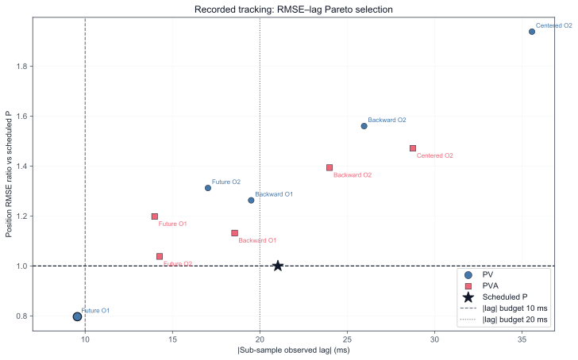
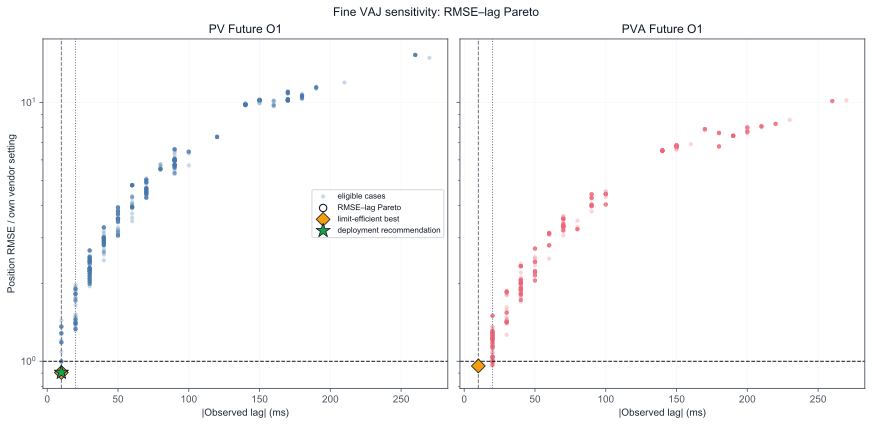

# Recorded Trajectory 上线实验最终结论

> 结论日期：2026-07-31
> 当前实际上线 baseline：P-only、`recorded_tasks_original_no_velocity_limit`、
> `V/A/J=4.2/8.2/41`。
> PV/PVA 实验选型对象仍为 `recorded_tasks_simplified_with_velocity_limit`，
> 单轴、7,673 点、76.72 s、固定 10 ms 网格；主窗口 `t >= 0.04 s`。

## 1. 一页上线结论

| 决策项 | 结论 | 依据 |
|---|---|---|
| 报告 baseline | **当前实际上线 P-only，4.2/8.2/41** | E01 original no-velocity-limit replay |
| 目标状态 | **PV** | Future O1 下，PV 的 RMSE 低于 P，integer/sub-sample lag 也更小；PVA 的 RMSE 反而高于 P |
| 差分方式 | **Future O1** | A04 的 RMSE–sub-sample-lag Pareto 及 10/20 ms 档位选择一致 |
| 上线 VAJ | **4.1 / 8.2 / 3200** | 当前完整网格的 best tested deployment setting；保持 vendor Vmax、零 projection |
| 实验 paired 收益 | **RMSE -27.87%，integer lag 20 → 10 ms** | 相对原 A04/A06 velocity-limit P baseline；sub-sample lag 21.029 → 9.740 ms |

RMSE 与 `|observed lag|` 是同级指标，不使用跨单位加权总分。所有 P/PV/PVA
与 VAJ 收益数字仍只来自 velocity-limit recorded waveform；新增的当前上线
baseline 用于描述 status quo，不替换其他实验的 paired denominator。

| 角色/方案 | recorded waveform | VAJ | RMSE rad | integer lag | sub-sample lag | projection |
|---|---|---:|---:|---:|---:|---:|
| **报告 baseline：当前实际上线 P-only** | original no-velocity-limit | **4.2/8.2/41** | **0.0772111911** | **180 ms** | **180.768 ms** | N/A（NoGovernor） |
| 实验 paired baseline：Scheduled P | velocity-limit | 4.1/8.2/4000 | 0.0029509965 | 20 ms | 21.029 ms | 0 |
| PV + Future O1（vendor） | velocity-limit | 4.1/8.2/4000 | 0.0023518269 | 10 ms | 9.554 ms | 0 |
| PVA + Future O1（vendor） | velocity-limit | 4.1/8.2/4000 | 0.0035362433 | 10 ms | 13.976 ms | 64 |
| **PV + Future O1（候选）** | **velocity-limit** | **4.1/8.2/3200** | **0.0021286588** | **10 ms** | **9.740 ms** | **0** |

当前上线 baseline 与候选同时改变了 waveform 和 VAJ，因此
`0.0772111911 → 0.0021286588` 不能解释为单因素上线收益。可审计的
`-27.87% / 20→10 ms` 仍来自同一 velocity-limit waveform 内的 paired
comparison；其余实验 baseline 不变。E01 数值是对当前上线配置的离线 replay，
不是生产环境 telemetry。

当前上线候选为
`PV + Future O1 + V/A/J=4.1/8.2/3200`。它是当前轨迹的 best tested
setting，不是跨轨迹通用默认值。

## 2. P-only 是否因果，PV 还是 PVA

当前项目与上线信息契约一致：

- 在周期 `t_k`，follower 起始状态来自上一周期已经完成的输出状态；
- 当前周期允许读取预先排程的 target command `P[k+1]`；
- Scheduled P baseline 只使用这个已知的 `P[k+1]`，不读取未来测量值或未来
  PVA，因此在该契约下是因果的；
- 不应把 baseline 改成 `P[k]`。那表示“不允许提前获得下一拍位置”的另一种
  契约，会人为再增加一拍 target age，不适用于当前系统。

所以实验 paired P baseline 的 20 ms，以及当前实际上线 baseline 的 180 ms，
都不是“偷看未来”造成的，也不需要再人为加 10 ms；它们分别是各自
waveform/VAJ 下 follower 输出相对 reference 的波形对齐结果。

A04 对保留完整 trace 的 10 个候选重新计算了 sub-sample lag。PV Future O1
的 RMSE/P 为 0.796960，sub-sample lag 为 9.554 ms；它同时优于实验 paired
P baseline 的 RMSE 和 21.029 ms lag，并支配其余 PV/PVA 候选。10 ms 和
20 ms 两档 lag budget 得到相同选择。

PVA Future O1 的 integer lag 虽也是 10 ms，但 sub-sample lag 为
13.976 ms，且 RMSE 比 P 高 19.83%，因此不选 PVA。

## 3. 差分与输入要求

Future O1 的上线契约：

- 固定等间隔 `h = 10 ms`；
- 每拍可提前获得 target command `P[k+1]`；
- 速度由三个已知位置构造：
  `V[k+1] = (2P[k] - 3P[k-1] + P[k-2]) / h`；
- 前两拍历史不足时必须保持实验中定义的 startup 行为；
- recorded input 没有 V/A truth，差分量是在线 target 构造量，不是测量真值。

E01 现同时覆盖三条解析轨迹、original recorded 和 velocity-limit recorded。
证据角色严格分开：

| 输入 | 角色 | 可否用于上线 PV/PVA 收益 |
|---|---|---|
| 解析轨迹 | 中间公式与方法正确性验证 | 否 |
| original recorded，P-only 4.2/8.2/41 | **当前实际上线报告 baseline** | 只描述 status quo，不直接计算跨 waveform 收益 |
| velocity-limit recorded | P/PV/PVA、差分和 VAJ 选型 | **是** |

E01 新增的 current-online case 在 original recorded 上为：RMSE
0.0772111911 rad、integer lag 180 ms、sub-sample lag 180.768 ms；执行完整，
无 velocity/acceleration/profile constraint、fallback、solver failure 或
deadline miss。160/170/180/190/200 ms 对齐后的 RMSE 依次为
0.0323856/0.0315724/0.0312682/0.0314917/0.0322346 rad，确认 180 ms 是搜索
区间内部的局部最小值，不是 ±200 ms 边界截断。

E01 原有 velocity-limit P baseline 与 E11 同方法 command trace 逐字节一致：
RMSE 0.0029509965 rad、integer lag 20 ms、sub-sample lag 21.029 ms。该 arm
及 E11/E12 paired baselines 均未改变。

## 4. Velocity-limits 要求

“采集时带 velocity-limit”标签和 runtime `Vmax` 是两件事。前者不能证明
在线构造的 PV target 可执行，也不能用不同 waveform 的差异推导单因素因果
收益。

当前 PV Future O1 在 vendor `Vmax=4.1 rad/s` 下：

| 检查 | 结果 |
|---|---:|
| raw `max(abs(V))` | 2.5987607 rad/s |
| raw `P95(abs(V))` | 0.3148178 rad/s |
| velocity-limit violation | 0/7,670 个成熟样本 |
| target projection（vendor VAJ） | 0/7,672 拍 |

上线仍须逐拍执行 configured-limit projection，并检查 V/A/jerk 与 stopping
envelope admissibility；同时监控 projection count/rate、constraint
violation、fallback、solver failure、run completeness 和 deadline。

A03 的 original waveform Vmax 消融只用于归因诊断：Vmax 4.1→10 后其
RMSE interaction 与 lag interaction 都为 0。它不进入上线 scorecard，也不
参与 PV/PVA 排名或收益计算。

## 5. VAJ 与收益

E14 的完整证据为 PV/PVA 各 640 个设置，共 1,280 cases。该 compact
aggregate 完整保留 RMSE、integer lag、projection 和 guardrail，但没有保留
足够 trace 来重建整个 sub-sample Pareto。

| 角色 | VAJ | RMSE rad | integer lag | sub-sample lag | projection |
|---|---:|---:|---:|---:|---:|
| Vendor PV | 4.1/8.2/4000 | 0.0023518269 | 10 ms | 9.554 ms | 0 |
| **上线推荐** | **4.1/8.2/3200** | **0.0021286588** | **10 ms** | **9.740 ms** | **0/7,672** |
| 限值效率等价点 | 1/8.2/3200 | 0.0021286588 | 10 ms | 9.740 ms | 6/7,672 |
| PVA tested minimum | 1/7.5/3200 | 0.0033910493 | 10 ms | 未补跑 | 69/7,672 |

`V=1` 与 `V=4.1` 的 J=3200 两点补充 replay 得到完全相同的 RMSE 和
sub-sample lag；因此保持 vendor Vmax、消除 velocity projection 不损失这两项
性能。

相对 vendor J=4000，J=3200 的 RMSE 再降低 9.49%，integer lag 不变，
但 sub-sample lag 增加 0.186 ms。因此亚采样口径下两者是轻微 trade-off，
不是严格支配。完整 surface 的选择仍以可审计的 integer lag 为准；上线前应在
目标机预先定义 sub-sample lag 容差并复核。

最佳点位于 A 网格上边界，所以 `4.1/8.2/3200` 只能称为当前网格的 best
tested deployment setting，不能声称连续 VAJ 空间的全局最优。

## 6. Lag 口径与上线验证

| 指标 | 含义 | 使用方式 |
|---|---|---|
| integer lag | 10 ms 网格上使位置 RMSE 最小的实际移位 | 完整 surface 的可审计主口径 |
| sub-sample lag | 最优整数点及相邻两点 MSE 的局部二次插值 | 检查 10 ms 分辨率敏感性 |
| wall-clock latency | 实际计算、调度、通信与执行延迟 | 目标机单独测量 |

sub-sample lag 提高的是估计分辨率，不会创造新的采样信息；两种 waveform
lag 都不是 wall-clock latency。

上线前必须在目标机器同时通过：

1. raw-time position RMSE、integer lag 与 sub-sample lag；
2. projection count/rate 及原因分解；
3. constraint violation、fallback、solver failure、run completeness；
4. deadline miss、wall-clock latency 和源时间戳 jitter；
5. 机器人闭环稳定性及独立 recorded trajectory holdout。

此外，若要给出“相对当前实际上线”的正式收益，必须把 current-online P-only
和候选 PV 放在同一底层 recorded source、同一输入处理链、同一目标机器上做
paired replay；当前跨 waveform 的原始数值不能替代这一步。

当前证据仍是单轴离线 replay，未重放源时间戳抖动；A04 的 PV Future O1 在
当前离线主机有 1/7,672 次 deadline miss，且来源 manifest 记录 dirty
worktree，因此尚不是 release 证明。

解析轨迹仅用于实验中间的方法正确性验证，不构成上线选型或收益证据。

## 证据索引

- [E01：P-only baseline 与输入角色](../experiments/E01_p_only_baseline/results.md)
- [A04：Velocity-limit recorded PV/PVA 与差分选型](../analyses/A04_recorded_pv_pva_fd_selection/RESULTS.md)
- [A06：Velocity-limit recorded VAJ 联合选型](../analyses/A06_pv_pva_vaj_fine_selection/RESULTS.md)
- [指标契约](metrics.md)
