# 仅位置输入下的 Ruckig 实时轨迹跟踪

> 来源：[飞书 Wiki 文档](https://psi-robot.feishu.cn/wiki/IgBlwaZf6i1F6jkcj8ucKUIqnSb?from=from_copylink)
>
> 当前实验口径：单关节、100 Hz；CSV 只读取 `value`，忽略 `elapsed time`、timestamp 和 topic，相邻两行固定按 10 ms 处理。
>
> 厂商固定约束：$v_{max}=4.1\,\mathrm{rad/s}$、$a_{max}=8.2\,\mathrm{rad/s^2}$、$j_{max}=4000\,\mathrm{rad/s^3}$。
>
> 名称说明：产品名称是 **Ruckig Tracking Interface**，实际 API 类名拼作 `Trackig`。本文用“tracking-aware follower”指代包括 `Trackig`、reference governor、jerk-QP/MPC 在内的通用能力。

本文回答三个问题：可靠的 velocity/acceleration 对普通 Ruckig 有多少价值；后向差分、离线中心差分和可在线运行的中心差分有什么区别；在固定厂商约束下，当前场景为什么仍需要面向移动参考的约束跟随能力。

## 摘要

仅有位置输入时，任务应拆成三层，而不是把一次差分直接等同于实时轨迹跟踪。生产链路还应把“目标位置流”和“机器人实测状态”作为两条不同输入：

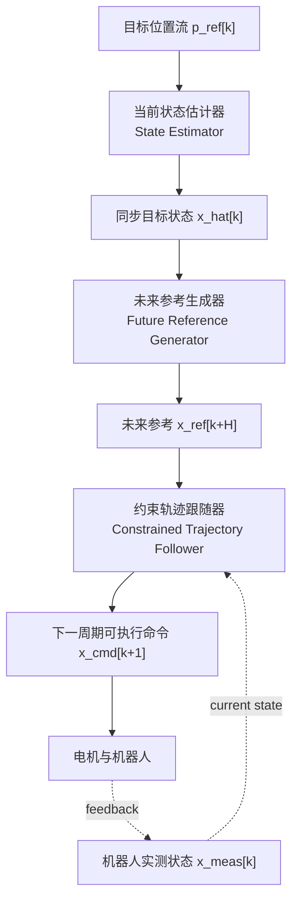

在固定 10 ms、固定 `4.1/8.2/4000`、无 lookahead、相同初态和相同目标投影下，新受控实验得到以下结论：

1. **可靠 velocity 明确有价值。** 三条无噪声解析曲线上，PV/PVA 解析真值相对 P 将 position RMSE 降低 74.65%～87.74%，并把 40～80 ms 整体滞后统一降到 10 ms。
2. **本组平滑解析曲线没有显示 PVA 比 PV 更优。** acceleration 不是普遍无用；这里只能说明在当前低动态、一步可达场景中，可靠 velocity 已足以让普通 Ruckig 到达当前目标状态。
3. **零延迟对齐的标准中心差分不是实时算法。** 在 $t_k$ 输出属于 $t_k$ 的导数需要读取 $p_{k+1}$。相对后向差分，解析曲线 velocity RMSE 降低约 58～92 倍、acceleration RMSE 降低约 201～316 倍。
4. **接受固定一拍估计延迟时，中心差分可以因果部署。** 收到 $p_k$ 后可以得到时间戳一致的 $x_{k-1}$；但 10 ms 是 estimator 延迟，不自动等于端到端 tracking 延迟。本文的因果中心方案继续把状态传播到当前时刻，可显著改善 velocity；由于没有 jerk 模型，acceleration 仍属于上一采样时刻，其解析 RMSE 与后向差分相同。
5. **CSV 上未滤波差分没有胜过 P。** P 为 RMSE `0.03519 rad`、lag `70 ms`；差分方法为 `0.03874～0.07856 rad`、`70～160 ms`。这说明 estimator 质量是导数发挥价值的前置条件。
6. **CSV 的主要冲突是 acceleration target 不可行。** 三种 PVA 差分方法都有 32.64% 的原始目标需要投影；原始二阶差分峰值为 `280.09 rad/s²`，约为厂商 acceleration 限制的 34.2 倍。
7. **当前厂商 jerk 已远离历史低 jerk 瓶颈。** CSV 的 P 基线在 `j=41` 时 RMSE 是厂商点的 2.29 倍；从 `j=4000` 增至 `8000` 仅改善约 0.9%，lag 不变。提高 acceleration 也会降低部分误差，但超出厂商限制的点不能成为部署建议。
8. **需要的是 tracking-aware 能力，不是已经证明某个商业 API 必需。** 下一周期解析 oracle 在普通 `Ruckig.update()` 上达到 0 ms lag 和数值误差量级，证明关键是生成正确未来状态。Ruckig Pro `Trackig` 是优先评估的低集成成本 baseline，但当前 Community `0.17.3` 没有该接口，本项目尚未实测 Pro。

正式数据、图表和复现说明见 [`results/vendor_target_state_ablation`](../results/vendor_target_state_ablation/README.md)。许可、供应链和工程风险见 [Ruckig Tracking 必要性与工程风险评估](ruckig_tracking_necessity.md)。

## 研究目标与实验路线

本仓库从完整遥操作链路中隔离出一个问题：上游以 100 Hz 只发送目标 position，普通 Ruckig 接收 target state 后生成下一周期命令，而当前线上 target 固定为 $[p_k,0,0]$。最终目标是在不修改厂商 `4.1/8.2/4000` 约束的前提下，生成比这一基线更合理、严格因果并且可由普通 Ruckig 执行的 target PVA。

解析曲线上的 GT 实验只证明：当移动参考的 velocity/acceleration 可靠且 target 可达时，完整目标状态能够降低普通 Ruckig 的跟踪误差和延迟。它不证明直接有限差分适合真实 position stream。CSV 上的失真同时包含导数噪声放大、target 不可达和普通 Ruckig 滚动追赶终态三个问题，因此也不能反向得出“target velocity/acceleration 无用”。

Future Reference Generator 应位于原始 position stream 与 Ruckig 之间，而不是“放在 CSV 之前”。CSV position 始终是期望参考和 position tracking 的评价基准；FRG 输出只是内部预测目标，不是新的 ground truth，也不提供 CSV 中不存在的 velocity/acceleration 真值。FRG 负责决定要追踪哪个未来状态，Executable Target Governor 再把该状态转换为时间戳明确、相邻状态 VAJ 一致且一步可达的 target PVA：

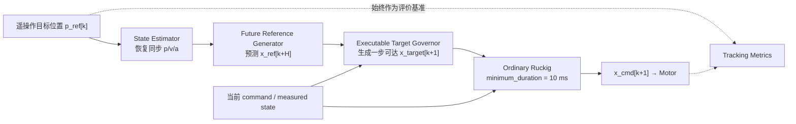

因此，研究对象不是单独寻找一条更好的差分公式，而是验证以下因果映射能否稳定优于 P-only：

$$
p^{ref}_{0:k},x^{cur}_k
\longmapsto
x^{target}_{k+1}=[p^{target}_{k+1},v^{target}_{k+1},a^{target}_{k+1}]
\longmapsto
x^{cmd}_{k+1}
$$

第 5 节给出从已完成论证到最终结论的预注册实验路线和验收门槛。

## 1. 任务定义与架构

### 1.1 输入、输出与时间语义

上游每 10 ms 提供一个新位置 $p_k$。CSV 实验直接定义：

$$
t_k=k\,DT,\qquad DT=0.01\,\mathrm{s}
$$

`elapsed time` 和其他时间列不参与当前实验。该结论只适用于“每行固定 10 ms”这一约定，不应与按原始时间戳重采样的另一种实验混用。原始 CSV 的相邻 `elapsed time` 间隔约为 `2.47～21.75 ms`，其中约 39.9% 不在 `8～12 ms`；这不破坏当前固定时间轴实验的内部一致性，但说明上线 estimator 必须先明确输入究竟是严格 100 Hz 重放，还是带采样/传输抖动的时间戳数据。后一种情况应先重采样或使用支持非均匀时间步长的估计器。

系统三层可写为：

$$
\hat{x}_k=\operatorname{EstimateState}(p_{0:k})
$$

$$
\bar{x}_{k+H}=\operatorname{GenerateFutureReference}(\hat{x}_k,H)
$$

$$
x^{cmd}_{k+1}=\operatorname{FollowConstrained}
(x^{cur}_k,\bar{x}_{k+H},v_{max},a_{max},j_{max})
$$

其中 $x=[p,v,a]$，$x^{cur}_k$ 必须明确取机器人反馈状态，还是在理想执行假设下取上一拍 command state。三层职责分别是：

| 层 | 输入 | 输出 | 责任 |
| --- | --- | --- | --- |
| State Estimator | 当前和历史位置 | 同一目标时刻的 $\hat p,\hat v,\hat a$ | 因果恢复状态并抑制微分噪声 |
| Future Reference Generator | 当前估计与预测模型，或已知未来序列 | $t+H$ 的未来位置或完整状态 | 决定目标属于哪个未来时刻 |
| Constrained Trajectory Follower | 当前执行状态与未来参考 | 下一周期可执行状态 | 维持状态连续并满足 VAJ 约束 |

严格在线时，未来参考只能由模型预测；完整 CSV 已知时，可以直接 preview 未来样本或离线优化。这两类信息条件必须分开评价。

### 1.2 普通 Ruckig 为什么会追赶旧目标

[Ruckig 原论文](https://www.roboticsproceedings.org/rss17/p015.html)处理受 velocity、acceleration 和 jerk 限制的状态到状态问题：从当前完整状态到达一个固定目标状态。当前普通接口每周期只执行新轨迹的第一个 10 ms，然后用下一目标重新规划。

若在周期 $k$ 把属于当前时刻的 $x_k$ 设为终态，`update()` 返回的是一个控制周期后的输出。因此本实验显式记录：

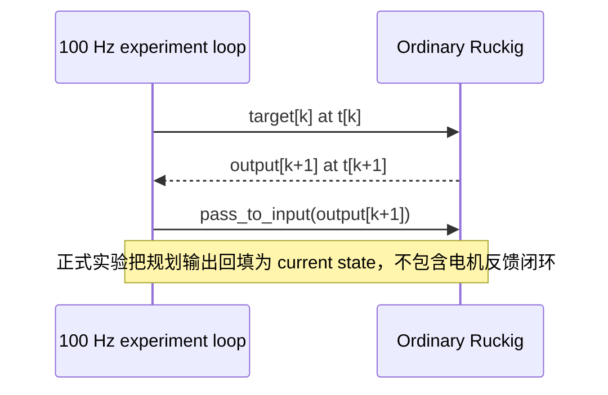

即使 $x_k$ 完全准确，输出也自然比参考晚一个周期。若目标还不能在 10 ms 内到达，重复设置当前移动目标会形成更长的滚动追赶。

官方 Tracking 教程也将这一问题作为 Tracking Interface 的动机：对移动信号直接重复普通 target 会滞后，Tracking Interface 通过目标预测降低滞后。[官方 Tracking 教程](https://docs.ruckig.com/tutorial.html#tracking-interface)

### 1.3 “需要 tracking”应如何理解

当前证据支持的是：系统需要可靠 estimator、未来参考和 tracking-aware constrained follower 的组合。它不支持以下更强命题：

- Pro `Trackig` 已在本项目上优于所有替代方案；
- 只要把差分 $v/a$ 送入普通 Ruckig 就完成了 tracking；
- 放宽厂商 acceleration/jerk 就是可接受的优化；
- 离线中心差分可以在不引入显式延迟或预测的前提下直接部署到严格在线链路。

`Trackig`、stateful reference governor 和 jerk-QP/MPC 都能承担第三层。Pro 的优势是与现有 Ruckig 集成路径短；它是不是最终方案需要直接实验。

### 1.4 三种“可行”不能混用

一个 target 没有越过 velocity/acceleration 边界，不代表它能在一个控制周期内到达；单个 target 可达，也不代表整条 sampled sequence 在 VAJ 意义下动态一致。本文区分：

1. **点态 admissibility**：target 的 velocity、acceleration 及终态边界条件可被求解器接受；
2. **时域 reachability**：从当前执行状态到 target 的最短轨迹时间满足 $T_{min}\le H$；
3. **序列 consistency**：相邻 target 的 $p/v/a$ 能由受限 jerk 的连续运动连接。

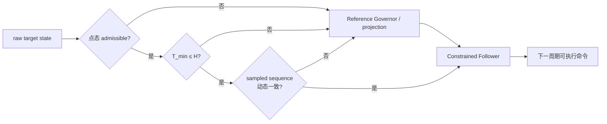

Future Reference Generator 主要解决目标时刻与预测问题，并不自动保证后两种可行性。`minimum_duration=H` 也只是轨迹时长下界，不是“必须在 $H$ 内到达”的 deadline。

## 2. 受控实验设计

### 2.1 固定变量

| 项目 | 正式值 |
| --- | ---: |
| 控制周期 | 10 ms |
| 最大 velocity | 4.1 rad/s |
| 最大 acceleration | 8.2 rad/s² |
| 最大 jerk | 4000 rad/s³ |
| lookahead | 0 ms |
| `minimum_duration` | 10 ms |
| CSV 输入列 | 仅 `value` |
| CSV 原始样本 | 1936 行，19.35 s |
| 解析曲线运动段 / 静止收敛段 | 3 s / 2 s |
| 目标时序 | `target[k] → output[k+1]` |
| 求解接口 | 普通 `Ruckig.update()` |

基线固定厂商限制。OFAT 章节只为解释敏感性而临时改变一个约束；这些点不是部署候选。

### 2.2 解析参考

三条参考均用七次 time scaling。令 $T=3\,\mathrm{s}$、$\tau=t/T$：

$$
h(\tau)=35\tau^4-84\tau^5+70\tau^6-20\tau^7,
\qquad s(t)=T h(\tau)
$$

空间函数为二次、三次和正弦：

$$
f_q(s)=0.5(s-1.5)^2,
\quad f_c(s)=0.12(s-1.5)^3,
\quad f_s(s)=0.37\sin(2\pi s/3)
$$

解析 $p/v/a$ 通过链式法则计算，不由数值差分生成。参考峰值全部位于厂商限制内：

| 参考 | max velocity | max acceleration | max sampled jerk |
| --- | ---: | ---: | ---: |
| Quadratic | 1.506 | 4.785 | 13.466 |
| Cubic | 0.592 | 1.471 | 7.533 |
| Sine | 1.695 | 6.365 | 40.073 |

### 2.3 P / PV / PVA 和导数来源

| ID | target | 导数来源 | 信息条件 |
| --- | --- | --- | --- |
| P | $[p_k,0,0]$ | 无 | 在线基线 |
| PV truth | $[p_k,v_k^*,0]$ | 解析真值 | 解析曲线 oracle |
| PVA truth | $[p_k,v_k^*,a_k^*]$ | 解析真值 | 解析曲线 oracle |
| PV/PVA backward | $[p_k,\hat v_k,0/\hat a_k]$ | 历史后向差分 | 在线，但时间戳混合 |
| PV/PVA center offline | $[p_k,\hat v_k,0/\hat a_k]$ | 标准中心差分 | 非因果，使用一个未来样本 |
| PV/PVA center causal | $[p_k,\hat v_k,0/\hat a_k]$ | delay-1 中心估计并传播 | 在线补充 |

P 在每种导数来源的图中重复作为共同基线，但指标表只保存一次。解析数据运行 9 种方法；没有导数真值的 CSV 运行 7 种方法。

“保留完整一拍延迟、直接输出 $x_{k-1}$”是合理的待测在线方案，但不在当前 9/7 种正式方法中。当前 `center causal` 是“先估计 $x_{k-1}$，再传播到当前时刻并锚定 $p_k$”，不能把两者混为同一个实验条件。

### 2.4 三种差分的时间戳

历史后向差分为：

$$
\hat v_k^{BW}=\frac{p_k-p_{k-1}}{DT},\qquad
\hat a_k^{BW}=\frac{p_k-2p_{k-1}+p_{k-2}}{DT^2}
$$

一阶项近似 $t_k-DT/2$，二阶项近似 $t_k-DT$。把 $p_k$、$\hat v_k^{BW}$、$\hat a_k^{BW}$ 直接组成一个 target 会混合时间戳。

标准离线中心差分为：

$$
\hat v_k^{CD}=\frac{p_{k+1}-p_{k-1}}{2DT},\qquad
\hat a_k^{CD}=\frac{p_{k+1}-2p_k+p_{k-1}}{DT^2}
$$

它在内部采样点对齐到 $t_k$，但读取 $p_{k+1}$。因此它不能在 $t_k$ 零延迟输出；如果愿意等待一个采样周期，同一个三点公式可以在收到 $p_k$ 后因果地估计 $t_{k-1}$。

可在线运行的中心方案在收到 $p_k$ 后先估计 $t_{k-1}$：

$$
\hat v_{k-1}=\frac{p_k-p_{k-2}}{2DT},\qquad
\hat a_{k-1}=\frac{p_k-2p_{k-1}+p_{k-2}}{DT^2}
$$

再用常 acceleration 传播到 $t_k$：

$$
\hat v_k=\hat v_{k-1}+\hat a_{k-1}DT,
\qquad \hat a_k=\hat a_{k-1}
$$

target position 直接锚定最新的 $p_k$。该方案对 velocity 做了一拍补偿，但 acceleration 仍没有向前传播的 jerk 信息。

#### 接受固定 10 ms 延迟时如何使用中心差分

在 $t_k$ 收到 $p_k$ 后，三点窗口 $[p_{k-2},p_{k-1},p_k]$ 已完整可用，因此可以构造时间戳一致的延迟状态：

$$
\hat{x}^{delay}_{k-1}=
\left[
p_{k-1},
\frac{p_k-p_{k-2}}{2DT},
\frac{p_k-2p_{k-1}+p_{k-2}}{DT^2}
\right]
$$

这在数学上是严格因果、固定群延迟为 10 ms 的 estimator，适合作为在线 baseline。但在本文 `target[k] \rightarrow output[k+1]` 的索引下，estimator 延迟和 Ruckig 输出时序会叠加：

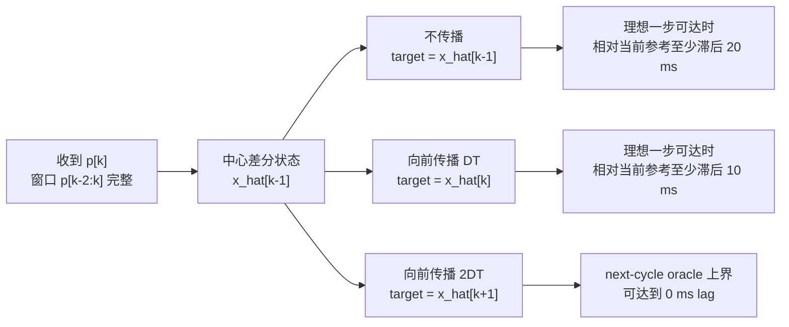

因此，“可以接受 10 ms tracking lag”时，不能简单把 $\hat{x}_{k-1}$ 原样送入当前 Ruckig 循环；需要至少传播到 $t_k$，或者重新定义命令与评价时间戳。传播越远，对 acceleration/jerk 模型的依赖越强。当前实现只对 velocity 做常 acceleration 补偿并令 acceleration 保持不变，所以它在平滑解析数据上有效，但不能消除 CSV 的二阶差分噪声。

该方案成立还依赖三个工程前提：输入先按时间戳对齐或重采样；可以接受确定的 group delay；位置噪声带宽足够低或导数前有平滑。允许延迟只解决因果性，不会降低 $1/DT^2$ 对 acceleration 噪声的放大。

### 2.5 投影和指标分层

实验先保存原始 $[p,v,a]$ target，再执行项目侧 target-state 可接受性检查；不可接受时只等比例缩放 velocity/acceleration，position 不变。这是本仓库定义的显式投影策略，不是 Ruckig 自动 clipping，而且可能把原本未超限的 velocity 与超限 acceleration 一起缩小。最终结果同时报告：

- **Estimator 层**：解析曲线的 velocity/acceleration RMSE、bias、最大误差；CSV 不虚构导数真值。
- **Target 层**：原始可行率、投影率、投影造成的 velocity/acceleration RMSE。
- **Tracking 层**：position RMSE、MAE、最大误差、全局 lag、对齐后 RMSE。
- **Reachability 层**：冻结当前 target 后的轨迹时长和 10 ms 内可达率。
- **Constraint 层**：输出 velocity、acceleration、`OutputParameter.new_jerk` 和离散 sampled jerk。

`output_max_new_jerk` 是每次实际执行后 `out.new_jerk` 的样本峰值，不是冻结整段 `trajectory` 内部 jerk 的全局峰值。`output_max_sampled_jerk` 是相邻输出 acceleration 的差分；两者也不能与 target acceleration 的差分混用。

## 3. 实验结果

### 3.1 差分本身是否准确

下表为解析真值上的导数 RMSE：

| 数据 | 方法 | velocity RMSE | acceleration RMSE |
| --- | --- | ---: | ---: |
| Quadratic | Backward | 1.2136e-2 | 7.9125e-2 |
|  | Center offline | 1.3188e-4 | 2.5001e-4 |
|  | Center causal | 2.6375e-4 | 7.9125e-2 |
| Cubic | Backward | 4.5758e-3 | 4.1940e-2 |
|  | Center offline | 6.9905e-5 | 1.7604e-4 |
|  | Center causal | 1.3980e-4 | 4.1940e-2 |
| Sine | Backward | 1.4593e-2 | 1.5033e-1 |
|  | Center offline | 2.5058e-4 | 7.4708e-4 |
|  | Center causal | 5.0113e-4 | 1.5033e-1 |

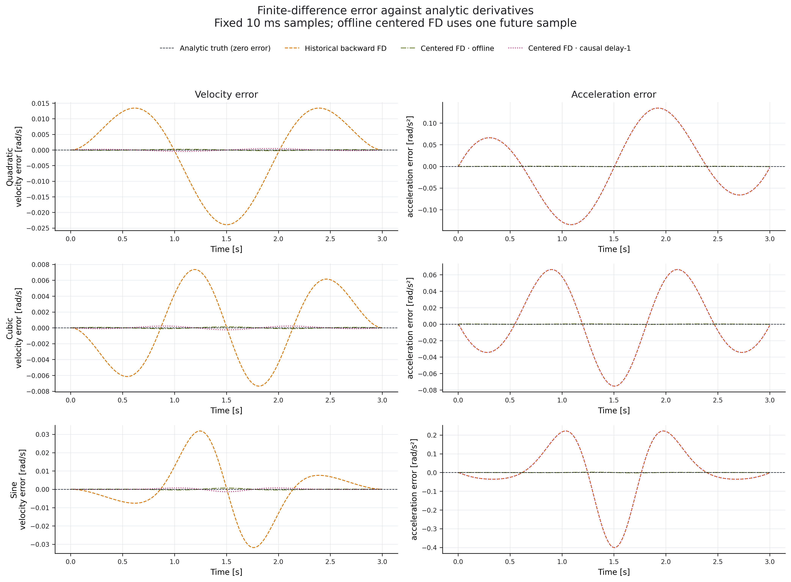

[完整导数指标](../results/vendor_target_state_ablation/derivative_source_metrics.csv)

离线中心差分明显优于后向差分，但其优势包含未来样本。因果中心方案的 velocity 仍接近真值；acceleration 与后向差分具有相同的一拍时间偏差，因此 RMSE 相同。这是“中点差分”在线化时最容易被忽略的区别。

### 3.2 从 P 到 PV/PVA：可靠导数的价值

| 数据 | P：RMSE / lag | PV truth：RMSE / lag | PVA truth：RMSE / lag |
| --- | ---: | ---: | ---: |
| Quadratic | 0.075667 / 80 ms | 0.009275 / 10 ms | 0.009275 / 10 ms |
| Cubic | 0.013624 / 40 ms | 0.003453 / 10 ms | 0.003453 / 10 ms |
| Sine | 0.049705 / 70 ms | 0.006750 / 10 ms | 0.006750 / 10 ms |

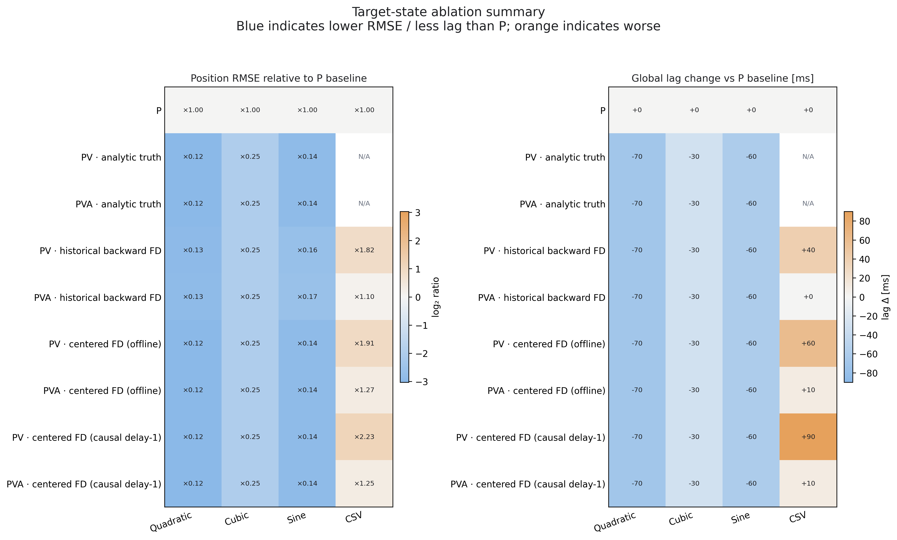

PV/PVA 相对 P 的改善说明，移动参考的终端 velocity 信息能显著减少普通 Ruckig 的停停走走语义。PVA 与 PV 在 position 指标上相同，只是当前实验的负结果：这三条参考平滑且均一步可达，不能外推为 acceleration target 在急停、强换向或更紧约束下也无价值。

即使使用当前时刻解析真值，PV/PVA 仍有精确的一周期延迟。下一周期 oracle 把 $x_{k+1}$ 作为周期 $k$ 的 target：

| 数据 | RMSE | 最大误差 | lag | 10 ms 可达率 |
| --- | ---: | ---: | ---: | ---: |
| Quadratic | 4.48e-16 | 7.55e-15 | 0 ms | 100% |
| Cubic | 6.12e-11 | 1.06e-9 | 0 ms | 100% |
| Sine | 2.68e-14 | 4.62e-13 | 0 ms | 100% |

[Oracle 指标](../results/vendor_target_state_ablation/oracle_sanity_metrics.csv)

该控制实验验证了图和指标的时间索引，也隔离出 future reference 的作用。它是完美预测上界，不代表现实 estimator 已经能够得到 $x_{k+1}$。

### 3.3 解析曲线中的差分来源

以 Sine 为例：

| 方法 | RMSE | lag | 对齐后 RMSE |
| --- | ---: | ---: | ---: |
| P | 0.049705 | 70 ms | 0.015612 |
| PV / PVA truth | 0.006750 | 10 ms | 约 0 |
| PV backward | 0.007833 | 10 ms | 0.001317 |
| PVA backward | 0.008252 | 10 ms | 0.001787 |
| PV / PVA center offline | 0.006750 | 10 ms | 约 0 |
| PV / PVA center causal | 0.006750 | 10 ms | 约 0 |

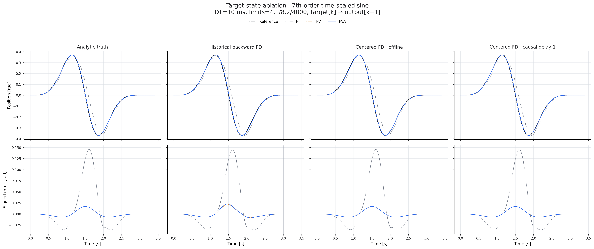

平滑解析输入下，即使导数估计存在小误差，约束跟随输出仍可能与真值方案非常接近。因此只看 position 曲线会掩盖 estimator 差异；需要同时查看 3.1 节的导数误差。Backward 在 Quadratic/Sine 上略差，Cubic 的运动更温和，所有导数方案在当前精度下相同。

### 3.4 CSV：差分噪声、PVA 收益与目标不可行

CSV 没有 velocity/acceleration ground truth，只能比较最终 tracking 和 target feasibility：

| 方法 | RMSE | 最大误差 | lag | 10 ms 可达率 | 投影率 |
| --- | ---: | ---: | ---: | ---: | ---: |
| P | **0.035187** | **0.184528** | **70 ms** | 8.74% | 0% |
| PV backward | 0.063978 | 0.327129 | 110 ms | 19.56% | 0% |
| PVA backward | 0.038741 | 0.240492 | **70 ms** | 20.49% | 32.64% |
| PV center offline | 0.067225 | 0.332870 | 130 ms | 23.07% | 0% |
| PVA center offline | 0.044701 | 0.260779 | 80 ms | **27.11%** | 32.64% |
| PV center causal | 0.078561 | 0.466188 | 160 ms | 17.64% | 0% |
| PVA center causal | 0.044109 | 0.243132 | 80 ms | 19.45% | 32.64% |

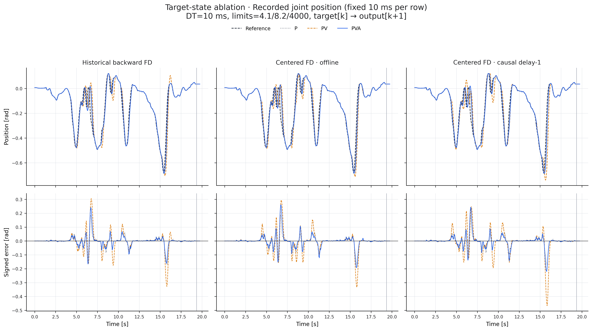

[完整 tracking 指标](../results/vendor_target_state_ablation/target_state_ablation_metrics.csv)

有三个需要同时保留的观察：

1. P 的 RMSE 最低。未经滤波的差分会把真实位置流的局部变化放大成不稳定 target，可靠导数在解析数据上的收益不能直接迁移到 CSV。
2. 在相同导数源内，加入 acceleration 后，PVA 相对 PV 的 RMSE 改善 33.51%～43.85%。因此不能简单说 acceleration 无用；它在普通 Ruckig 的终态语义中确实改变了结果。
3. PVA 改善的一部分发生在 target 投影之后。三种 PVA 的原始 acceleration 峰值均为 `280.09 rad/s²`，原始 target sampled jerk 为 `44460.85 rad/s³`；32.64% 的目标被等比例缩放。投影造成的 acceleration RMSE 为 `30.37 rad/s²`。

这些数值不是机器人真实 acceleration/jerk，也不是 Ruckig 输出超限；它们是从 position-only CSV 构造的原始 target 诊断量。所有最终输出的 velocity、acceleration 和 `new_jerk` 都满足各自实验约束。

因此当前 CSV 结果的正确结论是：**直接有限差分不是足够可靠的实时 estimator**。下一轮应比较带宽明确的因果 estimator，并把 estimator error、future-reference error 和 follower error 分开记录。

### 3.5 Acceleration 和 jerk 的影响

OFAT 固定 $v_{max}=4.1$：

- acceleration：`4.1, 6.0, 8.2, 12.0, 16.4`，jerk 固定 4000；
- jerk：`41, 200, 800, 1600, 3200, 4000, 8000`，acceleration 固定 8.2。

表中为 position RMSE：

| 场景 / 方法 | a=4.1 | a=8.2 | a=16.4 | j=41 | j=4000 | j=8000 |
| --- | ---: | ---: | ---: | ---: | ---: | ---: |
| Sine PV truth | 0.252167 | 0.006750 | 0.006750 | 0.227594 | 0.006750 | 0.006750 |
| Sine PVA truth | 0.187335 | 0.006750 | 0.006750 | 0.006750 | 0.006750 | 0.006750 |
| CSV P | 0.066178 | 0.035187 | 0.019318 | 0.080557 | 0.035187 | 0.034868 |
| CSV PVA center causal | 0.084552 | 0.044109 | 0.022871 | 0.259658 | 0.044109 | 0.043879 |

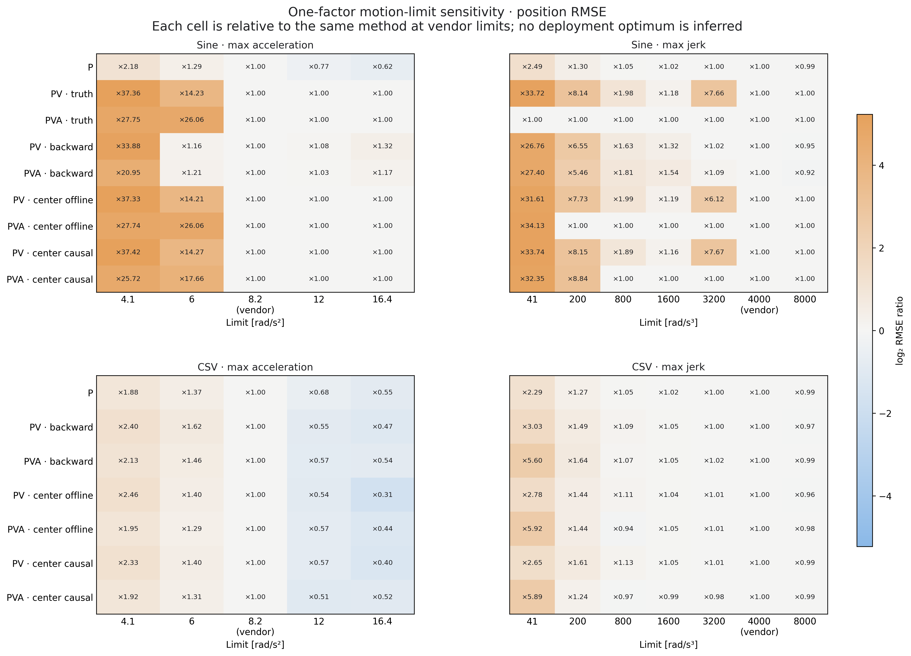

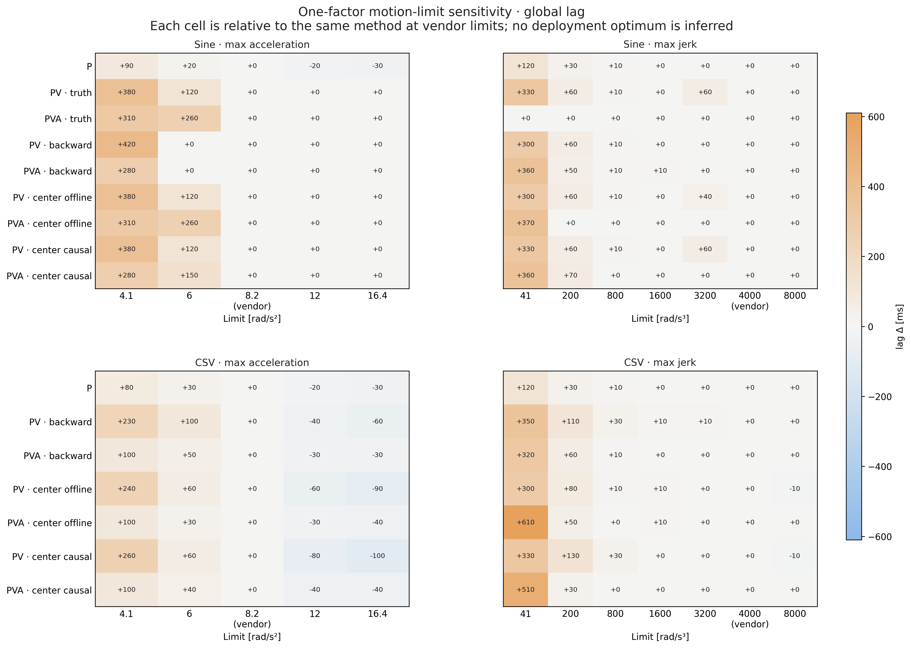

[完整 OFAT 指标](../results/vendor_target_state_ablation/limit_sensitivity_metrics.csv)

结果应这样解释：

- Sine 的真实 acceleration 峰值为 `6.365 rad/s²`，所以 `a=4.1` 本身低于参考需求；此时的恶化不能归因于 estimator。
- CSV 在更高 acceleration 下普遍改善，说明厂商 `a=8.2` 是当前跟踪误差的重要活动约束。但 12/16.4 超出厂商限制，不能作为“更合适的部署值”。
- `j=41` 对多数滚动终态方法过紧，显著增加 RMSE 和 lag。Sine PVA truth 在 `j=41` 仍保持不变，是因为参考 sampled jerk 峰值只有 `40.073`，并且 PVA 保留了正确 acceleration；PV 把终端 acceleration 强制为 0，反而需要更强 jerk 反复调整。
- `j=4000→8000` 对 CSV 仅改善约 0.5%～4.1%，lag 基本不变。当前场景没有证据支持修改厂商 jerk。
- 个别方法对约束并非单调，因为每周期都在替换带不同 $p/v/a$ 的终态，Ruckig 会切换轨迹剖面。OFAT 不能导出跨数据集的“最佳 acceleration/jerk”。

## 4. 对实时方案的含义

### 4.1 Estimator 和 lookahead 是两类责任

用户提出的两部分理解是正确的，但还应显式保留第三层 follower：

1. **Estimator**：从仅有的 $p_{0:k}$ 估计属于同一时刻的 $\hat p_k,\hat v_k,\hat a_k$；
2. **Future Reference Generator / lookahead**：预测 $t_k+H$ 的目标参考；
3. **Constrained Follower**：从当前执行状态生成满足 VAJ 的下一周期命令。

Estimator 解决“现在状态是什么”，lookahead 解决“应该追哪个未来时刻”，follower 解决“如何在约束内执行”。把三者混在一个函数里，会无法判断失败来自微分噪声、预测偏差、目标不可行还是 follower 行为。

### 4.2 推荐的数据流

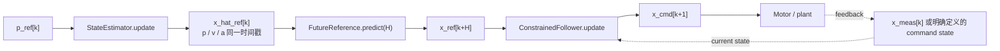

严格在线中心差分可以作为最小 baseline，但 CSV 结果说明它不应成为唯一 estimator。后续 estimator 候选可以包括带低通的局部多项式、Alpha-Beta-Gamma、常 acceleration/jerk Kalman Filter 或 tracking differentiator；比较时必须固定 follower、lookahead 和运动约束。

如果 `Trackig` 内部使用 prediction model，上游就不应再次预测同一段未来。可以让 estimator 只输出当前同步状态，由 `Trackig` 负责 prediction；也可以关闭内部预测，让统一 Future Reference Generator 负责。必须固定唯一预测责任方。

CSV 或在线 position stream 始终是期望参考和误差评价基准；Future Reference Generator 输出的是内部预测参考，不是新的“ground truth”。若预测参考仍满足不了 $T_{min}\le H$ 或序列 VAJ 一致性，还要由 governor/follower 做可行化并接受必要的跟踪误差。

### 4.3 Stateful jerk-limited reference governor：一个具体候选

飞书实验的分层诊断说明：即使 estimator posterior 和短期 position prediction 已经较接近原始参考，预测得到的完整 PVA target 仍可能在普通 Ruckig 的滚动终态语义中被显著放大。这个现象来自旧 `j=41` 探索，不能作为当前 `j=4000` 的定量结论，但它提示 Future Reference Generator 后面还需要一个有状态的可执行参考层。

一个最小候选是保存 command state $x_k^c=[p_k^c,v_k^c,a_k^c]$，每周期在当前状态和未来参考之间选择受限 jerk $j_k$，再按固定 $DT$ 积分：

$$
a_{k+1}^c=a_k^c+j_kDT
$$

$$
v_{k+1}^c=v_k^c+a_k^cDT+\frac{1}{2}j_kDT^2
$$

$$
p_{k+1}^c=p_k^c+v_k^cDT+\frac{1}{2}a_k^cDT^2+\frac{1}{6}j_kDT^3
$$

并显式约束 $|j_k|\le j_{max}$、$|a_{k+1}^c|\le a_{max}$、$|v_{k+1}^c|\le v_{max}$。与逐点裁剪独立的 $p/v/a$ 不同，这种更新使相邻 command state 在所采用的离散运动学模型下动态一致；jerk 可以由反馈律、投影或 10～30 拍的短时域 QP/MPC 选择。

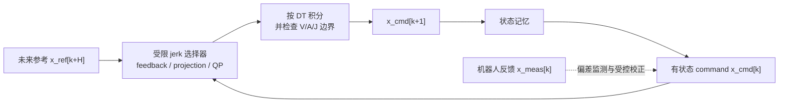

这只保证生成序列的运动学一致性，不保证模型外的电机动力学、碰撞或力矩可行。若该层已经直接生成下一拍可执行命令，就不应再无条件通过第二个 follower 重复平滑；若仍把它的状态作为普通 Ruckig target，则必须单独测量二次整形引入的 lag。生产实现还要定义 command state 与测量状态偏离时的校正、重置和 fallback 规则。

### 4.4 为什么仍应评估 Ruckig Tracking

当前实验形成了完整逻辑链：

1. P 在平滑解析输入上产生 40～80 ms lag；
2. 可靠 velocity 把 lag 降到接口固有的 10 ms；
3. next-cycle oracle 又把 10 ms 降到 0；
4. CSV 的直接差分却无法可靠提供这个未来状态；
5. 厂商 acceleration 限制又使大量原始 PVA target 不可行。

所以系统需要同时处理“状态估计”“未来目标”和“受限跟随”。Ruckig Pro `Trackig` 的接口正对这一任务，适合作为首个独立 baseline；但 governor 或 MPC 也可以实现同一能力。必要的是功能，不是未经实验的产品结论。

## 5. 最终目标与实验推进计划

本节是后续实现的预注册路线。除被当前阶段明确锁定的变量外，不在同一排名中同时改变 estimator、prediction horizon、target-state mode、governor 和 `minimum_duration`。阶段 A 已完成；阶段 B～E 依次执行，只有上一阶段通过对应检查后才锁定配置进入下一阶段。


### 5.1 阶段 A：完成必要性与差分边界论证

保留 P、解析 PV/PVA GT、历史后向差分、离线中心差分和 delay-1 因果中心差分。该阶段已经在固定 `DT=10 ms`、`4.1/8.2/4000`、`minimum_duration=10 ms` 下完成，并形成三个边界：

1. 可靠 velocity 能显著降低平滑解析参考上的误差和 lag；
2. 零延迟对齐的离线中心差分非因果，delay-1 中心差分可以在线运行但引入固定估计延迟；
3. 真实 CSV 的直接二阶差分会放大局部变化并产生大量不可接受 target，不能直接作为上线 PVA。

该阶段只建立“更好的 target state 值得研究”，不选择最终 estimator、FRG 或 governor。

### 5.2 阶段 B：选择因果 State Estimator

固定普通 Ruckig、`minimum_duration=10 ms` 且不使用 future lookahead，比较：

1. delay-1 三点中心差分；
2. 固定窗口 Local Polynomial；
3. Alpha-Beta-Gamma；
4. 常 acceleration Kalman Filter。

这一阶段的 estimator 只输出一个物理时刻明确、PVA 分量同步的 posterior state，不负责预测 $t_k+H$。解析曲线报告 velocity/acceleration GT error；CSV 没有导数 GT，只报告 posterior position error、估计 VAJ 的统计量、平滑性和计算耗时。必须增加因果性检查：任意修改 $p_{k+1:}$ 都不得改变周期 $k$ 及以前的输出。

分别记录 estimator 固有 group delay 和端到端 tracking lag。若 estimator 在历史时刻生成 posterior，延迟补偿必须作为显式步骤记录，不能藏在 estimator 名称或 plotting shift 中。

### 5.3 阶段 C：独立选择 Future Reference horizon

锁定阶段 B 的 estimator，扫描预注册 horizon：

```text
H = 0 / 10 / 20 / 40 / 50 / 60 ms
```

每个 $H$ 分别比较 predicted position-only、PV 和 PVA；Ruckig 的 `minimum_duration` 始终固定为 10 ms，避免把 prediction horizon 和轨迹时长混为一个变量。完整 CSV 回放可以读取 $p_{k+H}$ 计算离线 prediction error，但算法输入仍只能包含 $p_{0:k}$。CSV 不报告并不存在的未来 velocity/acceleration GT。

每个配置同时记录 position prediction RMSE/MAE/max、最终 tracking 指标、raw prediction 的点态可接受率和冻结目标的自由轨迹时长。对 $H>0$ 定义：

$$
\rho_k=\frac{T_{free,k}}{H}
$$

其中 $T_{free,k}$ 必须在不设置 `minimum_duration` 的冻结求解中获得。报告 $\rho$ 的 P50/P90/P99、$\rho\le1$ 比例和连续超限区段；不能用设置 `minimum_duration=H` 后的 trajectory duration 反推 $T_{min}$。

### 5.4 阶段 D：生成一步可达的 target PVA

锁定 estimator 和 $H$ 后，把 $x^{ref}_{k+H}$ 作为远端跟踪目标，而不是直接作为普通 Ruckig 的终态。Stateful Executable Target Governor 保存上一拍 $x^{target}_k$，在 VAJ 边界内选择 $j_k$，按第 4.3 节的离散运动学积分得到 $x^{target}_{k+1}$。

传给 Ruckig 的每个 target 必须同时满足：

1. velocity/acceleration target 的点态 admissibility；
2. 从当前执行状态冻结求解时 $T_{free}\le DT$；
3. 相邻 target PVA 可由 $|j_k|\le j_{max}$ 的同一离散更新连接；
4. target 的 `state_time=t_{k+1}`，不能沿用 future reference 的 $t_k+H$ 标签。

第一版采用单步 bounded-jerk governor。只有它不能通过第 5.8 节验收时，才增加 10～30 拍的 jerk-QP/MPC；Pro `Trackig` 只作为拿到许可后的同口径对照，不是本仓库形成结论的前置条件。

### 5.5 阶段 E：形成可证伪的实验结论

最终比较必须使用相同 estimator、相同 $H$、相同 current state 和相同普通 Ruckig 配置：

1. deployed P-only：$[p_k,0,0]$；
2. predicted position-only：$[\hat p_{k+H},0,0]$；
3. governed PVA：一步可达的 $x^{target}_{k+1}$。

若 governed PVA 优于同一 FRG 下的 predicted position-only，才说明设置 target velocity/acceleration 带来了独立于 future position 的额外价值。若 predicted position-only 更优，正式结论应是“未来 position 有效，但当前方法生成的 target PVA 尚不可靠”，不能因为解析 GT 的正结果而强行上线 PVA。

当前单条 CSV 只能形成仓库级 proof of concept。跨轨迹泛化、真实时间戳抖动、电机闭环和多关节同步应作为后续独立验证，不能写入本实验的已验证结论。

### 5.6 固定接口、状态语义与 fallback

后续实现遵守以下逻辑接口：

| 组件 | 逻辑接口 | 输出时刻 |
| --- | --- | --- |
| State Estimator | `update(p_ref_k) → posterior_state` | 显式记录 posterior 所属时刻 |
| Future Reference Generator | `predict(posterior_state, H) → predicted_state` | $t_k+H$ |
| Executable Target Governor | `update(current_state, predicted_state, H) → target_state_k1` | $t_{k+1}$ |
| Ordinary Ruckig | `update(current_state, target_state_k1) → command_state_k1` | $t_{k+1}$ |

每层记录至少包含 `p/v/a`、计算周期 $k$、`state_time`、prediction horizon、是否 fallback、fallback reason、原始 prediction 和最终 executable target。实验 current state 继续使用上一拍 Ruckig output；它与生产环境的 measured state 是不同的信息条件。

启动历史不足、输入非有限、时间间隔异常或 governor 求解失败时，必须记录原因并回退到现有 P-only 行为 $[p_k,0,0]$。正式结果中单独统计 fallback rate；不得静默缩放或裁剪后仍把该样本计为原始方法。

### 5.7 分层诊断、时间对齐与产物

每次实验保存同一条样本经过各层后的状态，而不只保存最终 position RMSE：

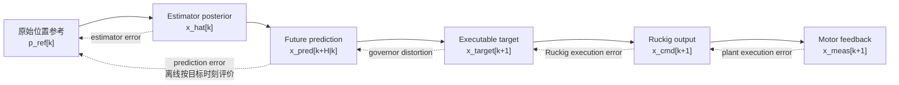

所有曲线按物理时间戳绘制：$x_{pred}[k+H|k]$ 画在 $t_k+H$，$x_{target}[k+1]$ 和 $x_{cmd}[k+1]$ 画在 $t_{k+1}$。CSV 回放中的未来 position 只用于离线评价 prediction error，不能进入在线数据流。

每次正式运行固定生成：`run.json`、逐层状态 CSV、汇总指标 CSV、horizon sweep 图、分层状态对齐图和错误/fallback 清单。运行记录必须包含输入、约束、代码哈希、estimator 参数、$H$、target-state mode、governor 参数和软件版本。

### 5.8 验收标准与自动测试

当前 CSV 的 deployed P-only 基线为 RMSE `0.035187 rad`、lag `70 ms`、最大误差 `0.184528 rad`。最终候选必须同时满足：

1. CSV RMSE 不高于 `0.02991 rad`、lag 不高于 `30 ms`、最大误差不高于 `0.184528 rad`；
2. governed PVA 相对同 estimator、同 $H$ 的 predicted position-only 至少降低 5% RMSE，且 lag 和最大误差均不恶化；否则不宣称 target PVA 获得部署收益；
3. 传入 Ruckig 的非 fallback executable target 投影率为 0，点态可接受率和 $T_{free}\le10\,\mathrm{ms}$ 比例均为 100%；
4. Ruckig 输出 velocity、acceleration、direct jerk 和 sampled jerk 均不越过 `4.1/8.2/4000`；
5. estimator、FRG、governor 和 Ruckig 分层报告 P50/P99/max 计算时间；实验机上总 P99 小于 1 ms、max 小于 5 ms。

自动测试覆盖：因果性、posterior/prediction/target 时间戳、一步 constant-jerk 积分、target admissibility、冻结轨迹时长、启动历史不足、换向、急停、离群点、非有限输入、时间间隔异常和 fallback。解析 next-cycle oracle 继续作为 `target[k] → output[k+1]` 索引与无额外 lag 的回归测试。

## 6. 结论边界

- 当前只有单关节运动学，没有机器人动力学和实机闭环。
- CSV 固定按每行 10 ms；当前结果有意忽略 `elapsed time`。
- CSV 没有 velocity/acceleration 真值，不能用差分间的一致性代替 ground truth。
- 零延迟对齐的离线中心差分使用未来样本，只是诊断基线；保留一拍延迟的中心差分可以在线运行，但尚未加入正式方法矩阵。
- 因果中心差分采用常 acceleration 传播，没有 jerk estimator。
- 10 ms estimator delay、Ruckig 的一拍输出时序和电机闭环延迟必须分别记录，不能合并命名为“10 ms tracking delay”。
- 正式循环使用 `out.pass_to_input()` 把规划输出作为下一拍 current state，假设命令被完美执行；生产链路必须单独定义何时采用 command state、何时采用机器人反馈状态以及偏差时如何重规划。
- 当前正式消融没有独立 Future Reference Generator，`lookahead=0`；历史 estimator/lookahead 探索把估计、预测和 `minimum_duration` 混在了一起。
- 全局 lag 以 10 ms 网格搜索，是粗粒度描述，不代替频域或局部延迟分析。
- OFAT 没有估计 acceleration/jerk 交互，也不用于修改厂商限制。
- target projection 是本实验的一种显式策略；其他 reference governor 可能产生不同折中。
- `out.new_jerk` 和 sampled jerk 都不是冻结轨迹内部 jerk 的完整证明。
- 当前调用普通 Ruckig Community `0.17.3`，没有直接 Pro `Trackig` 数据。

## 7. 复现

```bash
.venv/bin/python run_target_state_ablation.py \
  --mode all \
  --output-dir results/vendor_target_state_ablation

.venv/bin/python -m unittest discover -s tests -v
```

关键产物：

- [运行 manifest](../results/vendor_target_state_ablation/run.json)
- [正式 tracking 指标](../results/vendor_target_state_ablation/target_state_ablation_metrics.csv)
- [导数误差指标](../results/vendor_target_state_ablation/derivative_source_metrics.csv)
- [Oracle 指标](../results/vendor_target_state_ablation/oracle_sanity_metrics.csv)
- [OFAT 指标](../results/vendor_target_state_ablation/limit_sensitivity_metrics.csv)
- [结果目录说明](../results/vendor_target_state_ablation/README.md)

Manifest 记录固定数据口径、扫描网格、输入和核心代码 SHA-256、Git 状态以及 Python/NumPy/Matplotlib/Ruckig 版本。

## 附录：历史实验定位

早期结果保留为研发轨迹，不再与正式受控实验并列排名：

| 历史结果 | 主要问题 | 当前定位 |
| --- | --- | --- |
| `full/`、`selected-2/` | 生成代码和精确参数不完整 | 图片归档 |
| `middle-selected-2/` | 两次 `np.gradient`、未来样本、导数缩放/裁剪和不同限制同时变化；第二次梯度可使 acceleration 依赖 $p_{i+2}$，即 100 Hz 下最多使用 20 ms 未来信息 | 说明历史中心差分图的来源，不等同于本文严格三点中心差分 |
| 历史 `j=41` | jerk 远低于当前厂商 4000 | 低 jerk 敏感性背景 |
| `4.1/16/3200` | 同时放宽 acceleration、收紧 jerk | 开发过程配置 |
| 旧 estimator/lookahead 扫描 | 同时改变 estimator、lookahead 和 `minimum_duration`；曾显示 prediction 较准而 follower 输出仍显著偏离 | 支持分层诊断的必要性，不是严格 P/PV/PVA 消融，也不保留旧 CA-KF/ABG 排名 |

新目录 `vendor_target_state_ablation/` 不是旧图片的逐字节复现，而是在统一限制、统一时间语义和统一指标下重建关键问题。

## 参考资料

- Berscheid, L. & Kröger, T., [Jerk-limited Real-time Trajectory Generation with Arbitrary Target States](https://www.roboticsproceedings.org/rss17/p015.html), RSS 2021.
- Ruckig, [Tracking Interface 教程](https://docs.ruckig.com/tutorial.html#tracking-interface).
- Ruckig, [`Trackig` API](https://docs.ruckig.com/classruckig_1_1Trackig.html).
- Ruckig, [在线 Tracking 示例](https://docs.ruckig.com/example_14.html)与[离线 Tracking 示例](https://docs.ruckig.com/example_15.html).
- Gerelli, O. & Guarino Lo Bianco, C., [A Discrete-Time Filter for the On-Line Generation of Trajectories with Bounded Velocity, Acceleration, and Jerk](https://fileadmin.cs.lth.se/ai/Proceedings/ICRA2010/MainConference/data/papers/0271.pdf), ICRA 2010.
- Lange, F. & Albu-Schäffer, A., [Path-Accurate Online Trajectory Generation for Jerk-Limited Industrial Robots](https://elib.dlr.de/101288/), IEEE RA-L 2016.
- Stellato, B. et al., [OSQP: An Operator Splitting Solver for Quadratic Programs](https://web.stanford.edu/~boyd/papers/osqp.html), Mathematical Programming Computation, 2020.
