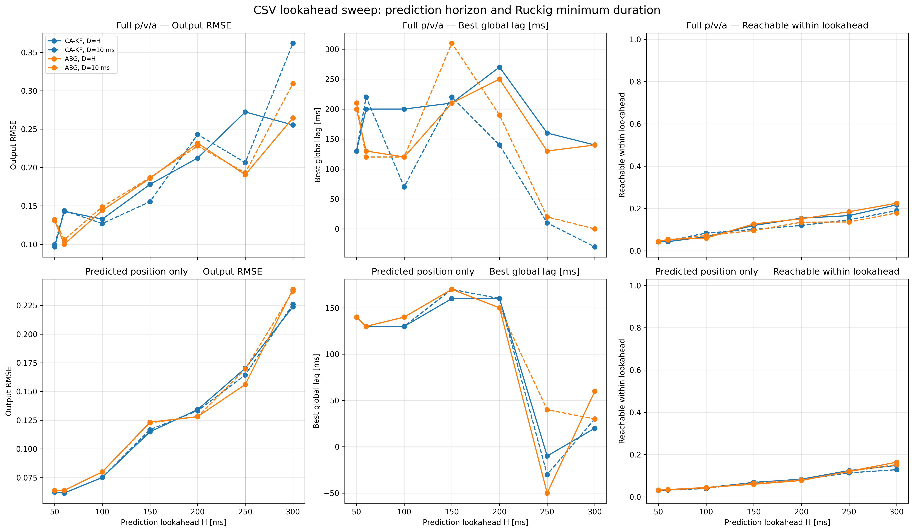
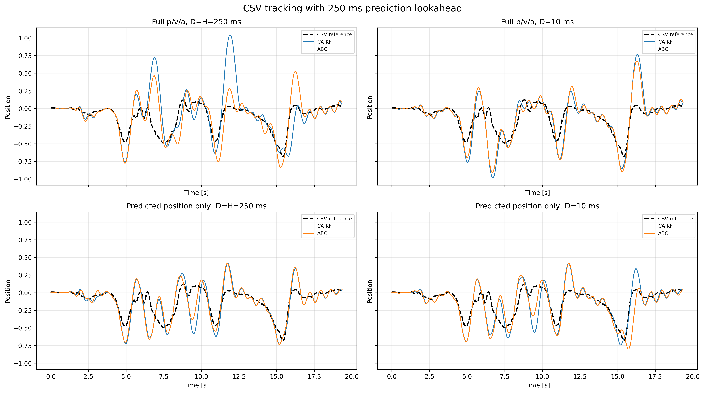
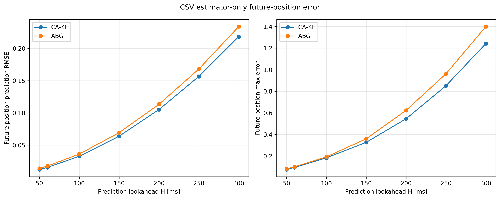

# Ruckig 实时跟踪优化

> 来源：[飞书 Wiki 文档](https://psi-robot.feishu.cn/wiki/IgBlwaZf6i1F6jkcj8ucKUIqnSb?from=from_copylink)

> 可复现性提醒：前情提要中的两张图片仍使用飞书内部临时下载链接，在仓库外或授权过期后可能无法显示。后续应下载到 `docs/assets/ruckig_realtime_tracking_optimization/`，再改为仓库内相对路径。实验 A 之后的图片已经使用本地 assets 或 `results/`。

## 前情提要

### Ruckig 的 target velocity 配置

当前的 target velocity 都是 0。在遥操作的实时控制中，waypoint 的速度不应该是 0。我的思路是将 target velocity 配置成输入的差分，希望能有效地减少加减速的时间，即加速度的均值更小，jerk 的持续时间更短。

a 是修改后的算法，b 是修改前的算法（main）。

“加速度的均值更小，jerk 的持续时间更短”还在评估，但是当前注意到响应下降。

## 实验背景

### 实验目标

实验研究一个单轴、100 Hz 的实时输入场景：上游每 10 ms 只提供一个新的目标位置，Ruckig 负责在速度、加速度和 jerk 约束下生成下一控制周期的状态。横轴是具有物理含义的时间，Ruckig 只规划纵轴的一维位置。

需要回答的问题是：目标速度和目标加速度设为 0、由位置差分得到、或由状态估计器得到时，哪种方式能在低延迟下更准确地跟踪连续位置流，同时不产生不可执行的滚动终态。

### 数据集

#### 初等函数

初等函数不是与一条七次曲线做空间拼接，而是使用七次 `smootherstep` 对时间进行重参数化。令 $T=3s$、$\tau=t/T$：

$$
h(\tau)=35\tau^4-84\tau^5+70\tau^6-20\tau^7
$$

$$
s(t)=T h(\tau),\qquad y(t)=f(s(t))
$$

$h$ 在首尾的一至三阶导数均为 0，因此组合后的曲线在首尾具有零速度、零加速度和零 jerk。关于物理时间的解析导数通过链式法则得到：

$$
\dot y=f'(s)\dot s
$$

$$
\ddot y=f''(s)\dot s^2+f'(s)\ddot s
$$

三种空间函数为：

| 曲线 | 函数 |
| --- | --- |
| 带极值点的二次函数 | $f(s)=0.5(s-1.5)^2$ |
| 三次函数 | $f(s)=0.12(s-1.5)^3$ |
| 正弦函数 | $f(s)=A\sin(2\pi s/3)$ |

初等函数持续 3 s，相邻采样点间隔 10 ms，结束后追加 2 s 静止段，便于观察收敛。它们可以提供位置、速度和加速度的解析真值，用于验证差分或估计器是否正确。

#### CSV

CSV 来自真实 MCAP 录包，只有 position，没有速度、加速度真值。实验只读取 `value`，忽略 `elapsed time`，并把相邻行固定解释为相隔 10 ms。因此 CSV 上标为 `true/estimated` 的导数只能是估计值，不能当作 ground truth。

### 当前统一实验条件

| 参数 | 数值 |
| --- | ---: |
| 自由度 | 1 |
| 控制周期 | 10 ms |
| 初等函数时长 | 3 s |
| 收敛静止段 | 2 s |
| 最大速度 | $4.1/s$ |
| 最大加速度 | $8.2/s^2$ |
| 最大 jerk | $41/s^3$ |

需要注意：实验 A/B 的图片是在迭代过程中生成的历史结果，部分曲线参数与当前统一配置不同。实验 A 的正弦振幅是 0.45，其七次时间缩放后的目标 jerk 峰值约为 $48.74/s^3$，已经超过 41；实验 B 和当前实验将振幅降为 0.37，目标 jerk 峰值约为 $40.07/s^3$。因此实验 A 与实验 B 的正弦图只能做定性比较，不能视为只改变差分公式的严格单变量实验。

### 普通 Ruckig 在线更新的语义

每个控制周期都把新的目标位置、速度、加速度传给普通 `Ruckig.update()`，再用 `output.pass_to_input()` 把本周期输出作为下一周期当前状态。普通 Ruckig 求解的是从当前状态到目标终态的 jerk 受限点到点轨迹，并不知道后续还会持续收到整条曲线。若目标终态不能在一个或少数控制周期内到达，每 10 ms 改写目标会导致持续重规划和固有追赶滞后。

### 对比方案

| 方案 | 说明 |
| --- | --- |
| 1. true/estimated velocity & acceleration | 初等函数使用解析真值；CSV 只能使用估计值 |
| 2. true/estimated velocity, acceleration = 0 | 初等函数速度使用解析真值；目标加速度设为 0 |
| 3. position-difference velocity & acceleration | 速度和加速度均来自位置；实验 A 使用后向差分，实验 B 使用中心差分 |
| 4. position-difference velocity, acceleration = 0 | 速度来自位置差分，目标加速度设为 0 |
| 5. position only (velocity = acceleration = 0) | 速度和加速度都是 0（当前上线的方案，baseline） |

实验 A/B 没有保存统一的数值指标表，阶段性判断主要来自曲线形态，因此下面使用“更贴近、滞后、过冲、振铃”等定性描述，而不把视觉选择表述成严格的全局排名。

### 图表与指标口径

- 黑色虚线表示输入参考位置；彩色曲线默认表示 Ruckig 最终输出位置，而不是估计器自身的位置估计。
- RMSE、MAE 和最大误差都按原始时间轴计算；因此同时包含形状误差与相位滞后。
- “最佳整体滞后”通过平移输出曲线寻找最小 RMSE 得到，正值表示输出落后参考。
- “时间对齐后 RMSE”用于区分整体滞后和真实形状失真：若原始 RMSE 大而对齐后 RMSE 小，主要问题是相位延迟。
- “目标状态投影率”表示估计器候选终态有多少比例需要缩放速度、加速度后才能满足 Ruckig 的单点目标状态检查；它不代表连续目标序列已经满足 jerk 约束。
- jerk（加加速度）按相邻加速度差除以 10 ms 计算。

### 实验 A：和 0603 实验对齐

实验 A 使用原始后向差分：

$$
v_k = \frac{p_k-p_{k-1}}{DT}
$$

$$
a_k = \frac{p_k-2p_{k-1}+p_{k-2}}{DT^2}
$$

这三个目标分量并不对应同一时刻：$p_k$ 对应 $t_k$，一阶后向差分近似 $t_k-DT/2$ 的速度，二阶后向差分近似 $t_k-DT$ 的加速度。把三者直接组成同一个 Ruckig 目标终态，会引入运动学时间戳不一致。

| 数据集 | 结果 |
| --- | --- |
| 二次函数 |  |
| 三次函数 |  |
| 正弦函数 |  |
| CSV |  |

为了聚焦比较，选择两种代表性实现：

| 方案 | 选择原因 |
| --- | --- |
| 3. 速度和加速度都是位置的后向差分 | 检查从位置补全完整终态能否降低滞后 |
| 5. 速度和加速度都是 0 | 当前上线 baseline，行为稳定但预期存在滞后 |

| 数据集 | 结果 |
| --- | --- |
| 二次函数 |  |
| 三次函数 |  |
| 正弦函数 |  |
| CSV |  |

#### 实验 A 观察

1. 对单调且变化较平缓的三次曲线，多种方案都能保持大体形状，但方案 5 的相位滞后更明显。
2. 即使输入解析真值速度、加速度，正弦等快速换向参考也不一定能被普通 Ruckig 无失真跟踪。终端状态正确不等于该状态能在当前控制周期内到达。
3. 在二次函数极值点和正弦换向区域，后向差分目标容易产生二次峰、回摆或过冲。原因不仅是差分噪声，还包括 $p/v/a$ 时间戳错位，以及滚动终态对 jerk 的需求不连续。
4. CSV 中方案 3 出现大幅振荡，说明直接对 10 ms 位置流做一阶、二阶差分并作为终端导数，对真实高频扰动非常敏感。
5. 方案 5 没有注入差分导数，整体更稳定；代价是每个滚动位置都被当作零速度、零加速度终点，响应会滞后。

因此，实验 A 只能说明“补充导数具有降低理想曲线滞后的潜力”，不能证明原始后向差分适合真实 CSV。其主要缺陷是导数放大噪声和目标状态时间戳不一致。

### 实验 B：从后向差分改为中心差分

实验 B 将方案 3 改成三点中心差分。收到 $p_k$ 后，估计 $t_{k-1}$ 时刻的状态：

$$
v_{k-1}=\frac{p_k-p_{k-2}}{2DT}
$$

$$
a_{k-1}=\frac{p_k-2p_{k-1}+p_{k-2}}{DT^2}
$$

位置、速度和加速度统一对应 $t_{k-1}$，代价是引入一个采样周期，即 10 ms 的显式信息延迟。实验 B 继续只比较方案 3 与方案 5。

这里需要区分“实时三点公式”和历史图片的生成方式。实验 B 的历史图片是在完整位置序列上计算中心导数后再运行 Ruckig，包含离线未来样本信息；如果通过两次中心 `gradient` 依次求速度和加速度，$a_i$ 实际会依赖到 $p_{i+2}$，等效需要 20 ms 未来数据。因此实验 B 更接近离线或固定滞后条件下的性能上界，不能直接解释为零延迟在线效果。当前可复现代码中的 `3-point central` 才严格使用 $p_{k-2},p_{k-1},p_k$，在收到 $p_k$ 后输出 $t_{k-1}$ 的状态。

| 数据集 | 结果 |
| --- | --- |
| 二次函数 |  |
| 三次函数 |  |
| 正弦函数 |  |
| CSV |  |

#### 实验 B 观察

1. 在二次、三次和振幅降至 0.37 的正弦曲线上，中心差分结果基本与目标重合，显著优于 Position only 的相位滞后。这说明当参考位置足够光滑、满足运动学约束时，用同一时间戳的 $p/v/a$ 终态能够发挥 Ruckig 的跟踪能力。
2. 中心差分解决了原始后向差分的时间戳错位，但没有消除二阶微分对测量噪声的放大。
3. 在真实 CSV 上，中心差分仍出现明显过冲和振铃，而 Position only 更稳定。这说明 CSV 的主要问题已不只是差分公式，而是 10 ms 位置扰动对应的加速度和 jerk 超出约束。
4. 实验 B 的近乎完美初等函数结果还受益于离线未来样本；进入严格因果的实时版本后，需要同时处理信息延迟、短期预测误差和终态可达性。
5. 实验 B 将问题从“差分是否对齐”推进到“只有位置时，如何在 10～30 ms 内得到平滑且运动学一致的状态估计”，因此需要实验 3 的递归估计器和可行性分析。

### 实验 3：对 CSV 加入估计器

#### 实验配置

- 采样周期：10 ms（100 Hz）。
- CSV 只读取 `value`，忽略 `elapsed time`，每一行固定按 10 ms 处理。
- 单轴运动约束：最大速度 $4.1/s$、最大加速度 $8.2/s^2$、最大 jerk $41/s^3$。
- CA-KF 前瞻 50 ms；ABG 前瞻 60 ms。
- 普通 Ruckig 使用与前瞻时间相同的 `minimum_duration`，每 10 ms 接收新的滚动目标状态。

对比的方法如下：

| 方法 | 说明 |
| --- | --- |
| Position only | 只输入当前位置，目标速度和目标加速度均为 0，当前线上 baseline |
| Raw backward difference | 原始后向一阶、二阶差分 |
| 3-point central | 三点中心差分，显式延迟 10 ms |
| SG-10 / SG-20 | 固定延迟局部三次多项式估计 |
| Alpha-beta-gamma | 固定增益常加速度状态估计，参数为 $0.401/0.11528/0.009504$ |
| Robust CA-KF | 常加速度、白 jerk 过程噪声 Kalman；$sigma_p=0.01$、$q_j=1000$ |
| Jerk-limited tracker | 由位置误差驱动、带硬 jerk 限制的三阶跟踪器 |

当前 CSV 图只展示按原始时间轴 RMSE 排名最好的三种方法：

[完整指标 CSV](../results/estimator/realtime_metrics.csv)

#### 最终 Ruckig 输出结果

| 方法 | RMSE | MAE | 最大误差 | 最佳整体滞后 | 时间对齐后 RMSE | 目标状态投影率 | 估计计算 P99 |
| --- | ---: | ---: | ---: | ---: | ---: | ---: | ---: |
| Position only | **0.08050** | **0.04643** | 0.38026 | 190 ms | **0.03124** | 0% | 0.17 us |
| Robust CA-KF | 0.09655 | 0.05674 | 0.36470 | **130 ms** | 0.08047 | 4.87% | 15.04 us |
| Alpha-beta-gamma | 0.10001 | 0.06003 | **0.35136** | **130 ms** | 0.08626 | 5.95% | 3.92 us |
| Jerk-limited tracker | 0.14890 | 0.08887 | 0.60887 | 410 ms | 0.05621 | 0.84% | 7.96 us |
| 3-point central | 0.18662 | 0.11479 | 0.69030 | 390 ms | 0.11904 | 29.56% | 1.38 us |
| Raw backward difference | 0.21674 | 0.14093 | 0.83817 | 390 ms | 0.15561 | 29.56% | 0.54 us |
| SG-10 | 0.21828 | 0.14097 | 0.94663 | 410 ms | 0.16113 | 46.51% | 4.08 us |
| SG-20 | 0.25532 | 0.17807 | 1.01388 | 390 ms | 0.19210 | 60.94% | 3.96 us |

从最终输出看，Position only 的原始 RMSE 最低，但仍存在约 190 ms 的整体滞后。CA-KF 和 ABG 将最佳整体滞后降低到约 130 ms，但在快速换向段出现明显过冲和回摆。所有估计器单周期计算 P99 都远低于 10 ms，因此计算性能不是当前瓶颈。

#### 分层诊断：失真不主要来自位置估计器

图中 CA-KF 和 ABG 曲线是 **Ruckig 最终输出**，不是估计器自身的位置输出。将链路拆开后，结果如下：

| 阶段 | Robust CA-KF | Alpha-beta-gamma |
| --- | ---: | ---: |
| 当前滤波位置 RMSE | 0.00176 | 0.00246 |
| 未来位置预测 RMSE | 0.01220（50 ms） | 0.01759（60 ms） |
| 未来位置预测最大误差 | 0.07515 | 0.10075 |
| 最终 Ruckig 输出 RMSE | 0.09655 | 0.10001 |
| 最终 Ruckig 输出最大误差 | 0.36470 | 0.35136 |

位置估计和短期位置预测本身相对准确，误差主要在“预测 $p/v/a$ 终态 → 单点可行域投影 → 普通 Ruckig 点到点滚动重规划”阶段被放大。

一个典型例子是 CA-KF 在 8.72 s 附近：

| 信号 | 位置 |
| --- | ---: |
| CSV 参考 | +0.111 |
| CA-KF 预测目标 | +0.113 |
| Ruckig 输出 | -0.253 |
| 最终误差 | -0.365 |

此时位置预测几乎正确，但 Ruckig 仍在执行之前的受限加减速过程。

#### 原因 1：目标状态不能在前瞻时间内到达

`minimum_duration` 只是轨迹时长的下限，并不保证目标能在该时间内到达。冻结每周期目标并检查 Ruckig 计算出的实际最短时长：

| 规划时长 | Robust CA-KF（前瞻 50 ms） | ABG（前瞻 60 ms） |
| --- | ---: | ---: |
| 中位数 | 264 ms | 284 ms |
| P90 | 738 ms | 749 ms |
| P99 | 1406 ms | 1429 ms |
| 最大值 | 1532 ms | 1581 ms |
| 超过设定前瞻的比例 | 95.8% | 94.6% |

绝大多数终态实际需要数百毫秒才能达到，但系统每 10 ms 又丢弃上一终点并重新规划。在快速换向时，Ruckig 仍沿上一规划方向运动，新的目标已经反向，因此形成宏观过冲和振铃。

#### 原因 2：估计目标的跨周期 jerk 不可执行

当前单点可行域投影可以把目标速度、加速度限制到各自边界内，但没有限制连续目标之间的加速度变化：

$$
|a_k-a_{k-1}|\leq J_{max}DT=41\times0.01=0.41
$$

投影后的目标状态统计为：

| 指标 | Robust CA-KF | ABG |
| --- | ---: | ---: |
| 目标 jerk P99 | 263.97 | 260.55 |
| 目标 jerk 最大值 | 419.15 | 413.96 |
| 目标 jerk 超过 41 的比例 | 29.9% | 32.1% |
| 原始估计加速度最大值 | 21.00 | 22.86 |

Ruckig 输出必须满足 $|j|\leq41$，因此无法跟随这组滚动终态。

当前投影还保持预测位置不变、只同比缩放速度和加速度。困难区段中，投影后的 $p/v/a$ 不再严格来自同一条可执行运动轨迹，会进一步增加重规划的不连续性。

#### 原因 3：CA-KF 和 ABG 的导数带宽相近且偏激进

CA-KF 当前使用 $q_j=1000$。其单周期加速度过程噪声标准差约为：

$$
\sqrt{q_jDT}=\sqrt{1000\times0.01}=3.16
$$

而 jerk 硬约束每 10 ms 只允许加速度变化 0.41。CA-KF 稳态位置创新对加速度的增益约为 230.5，即 1 mm 位置创新会产生约 0.2305 的加速度修正。

ABG 的加速度残差增益为：

$$
\frac{2\gamma}{DT^2}
=\frac{2\times0.009504}{0.01^2}
=190.08
$$

1 mm 位置残差会产生约 0.190 的加速度修正。两种方法的有效带宽接近，所以最终失真形态也很相似。

CA-KF 的 3 sigma 创新限幅在整份 CSV 中没有触发，当前所谓 Robust 处理并未对该数据产生实际作用。

#### 原因 4：CSV 在当前时间标尺下本身不可精确执行

仅从位置做中心差分，CSV 的运动学统计为：

| 指标 | CSV | 约束 |
| --- | ---: | ---: |
| 最大速度 | 2.05 | 4.1 |
| 最大加速度 | 75.67 | 8.2 |
| 加速度超限比例 | 17.25% | - |
| 最大 jerk | 6115.02 | 41 |
| jerk 超限比例 | 71.64% | - |

因此无法同时满足：严格经过每个 CSV 位置点、端到端延迟只有 10～30 ms、并严格遵守 $4.1/8.2/41$ 约束。当前问题不是算法计算不够快，而是输入时间尺度与运动学约束存在物理冲突。

#### 隔离实验

保留同一估计器的未来预测位置，但将目标速度、目标加速度设为 0：

| 输入 Ruckig 的目标 | Robust CA-KF | ABG |
| --- | ---: | ---: |
| 完整预测 $p/v/a$ | 0.0966 | 0.1000 |
| 只使用预测位置，$v=a=0$ | 0.0624 | 0.0639 |

隔离结果进一步说明：预测位置不是主要问题；把高波动的估计速度和加速度作为普通 Ruckig 的终端边界条件，是过冲的重要来源。

#### 前瞻时间扫描：是否可以直接使用 250 ms

为了验证“50 ms 目标通常需要约 250 ms 才能到达，是否应直接预测 250 ms”这一假设，对 CSV 增加了二维扫描：

- 预测前瞻：50、60、100、150、200、250、300 ms；
- 估计器：Robust CA-KF、Alpha-beta-gamma；
- 目标终态：完整预测 $p/v/a$，或只使用预测位置并令 $v=a=0$；
- Ruckig 最小时长：与前瞻相同，或固定为一个控制周期 10 ms。

250 ms 的完整结果如下。这里的“250 ms 内可达”按每周期 Ruckig 轨迹时长是否不超过 250 ms 统计。

| 估计器 | 目标终态 | 最小时长 | 输出 RMSE | 最佳整体滞后 | 对齐后 RMSE | 最大误差 | 未来位置预测 RMSE | 250 ms 内可达 |
| --- | --- | ---: | ---: | ---: | ---: | ---: | ---: | ---: |
| CA-KF | 完整 $p/v/a$ | 250 ms | 0.27242 | +160 ms | 0.26291 | 1.05761 | 0.15658 | 16.6% |
| CA-KF | 完整 $p/v/a$ | 10 ms | 0.20645 | +10 ms | 0.20643 | 0.83584 | 0.15658 | 14.6% |
| CA-KF | 仅预测位置 | 250 ms | 0.17026 | -10 ms | 0.17022 | 0.66826 | 0.15658 | 12.5% |
| CA-KF | 仅预测位置 | 10 ms | 0.16440 | -30 ms | 0.16391 | 0.64801 | 0.15658 | 11.4% |
| ABG | 完整 $p/v/a$ | 250 ms | 0.19065 | +130 ms | 0.17992 | 0.78028 | 0.16809 | 18.4% |
| ABG | 完整 $p/v/a$ | 10 ms | 0.19307 | +20 ms | 0.19287 | 0.79093 | 0.16809 | 13.6% |
| ABG | 仅预测位置 | 250 ms | **0.15609** | -50 ms | **0.15446** | 0.64498 | 0.16809 | 12.1% |
| ABG | 仅预测位置 | 10 ms | 0.16960 | +40 ms | 0.16880 | **0.63401** | 0.16809 | 12.0% |

结果否定了“把前瞻直接增大到 250 ms 即可匹配轨迹时长”的假设：

1. 文档中约 264 ms 的中位时长对应的是 **50 ms 预测目标**。改成 250 ms 后，目标被外推得更远，中位轨迹时长反而升至约 459～496 ms；250 ms 内可达率仍只有 11.4%～18.4%。
2. CA-KF 的未来位置预测 RMSE 从 50 ms 时的 0.01220 增至 250 ms 时的 0.15658；ABG 从 60 ms 时的 0.01759 增至 0.16809。换向误差已经超过延迟补偿收益。
3. 250 ms 下接近 0 或为负的最佳整体滞后并不代表跟踪更准确，而是远期外推使输出提前或过冲；其时间对齐后 RMSE 仍为 0.154～0.263。
4. 250 ms 最好的配置是 ABG 仅预测位置、最小时长 250 ms，RMSE 为 0.15609；仍显著差于扫描全局最优的 CA-KF 60 ms 仅预测位置配置（RMSE 0.06150，整体滞后 130 ms）。
5. 将最小时长从 250 ms 改回 10 ms 没有改变未来位置预测误差，也没有形成一致的改善，说明主要瓶颈已经转为远期预测误差和目标可达性，而不是 `minimum_duration` 的单个参数。

完整数据见 [`lookahead_sweep_metrics.csv`](../results/lookahead_sweep/lookahead_sweep_metrics.csv)，估计器自身的未来位置误差见下图：

## 实验结论

1. 对光滑且运动学可行的初等函数，中心差分和局部多项式能较准确恢复导数并跟踪目标；从后向差分改成中心差分可以解决 $p/v/a$ 时间戳不一致的问题。
2. 对真实 CSV，微小高频位置扰动经二阶、三阶微分后被显著放大，直接差分和短窗 SG 均会产生大量不可行目标状态。
3. CA-KF 和 ABG 的位置估计本身较准确，但其导数状态跨周期不满足 jerk 约束；普通 Ruckig 又是点到点规划器，而不是任意移动信号跟踪器，两者叠加产生明显失真。
4. Position only 的原始 RMSE 最低，是因为它没有注入高波动的导数终态；代价是约 190 ms 滞后，不能说明其状态估计更准确。
5. 当前最重要的优化不是继续单独微调估计器，而是在估计器和 Ruckig 之间增加一个**状态化、jerk 受限的可执行参考生成层**。
6. 50～300 ms 扫描表明，250 ms 常加速度前瞻不能解决滚动终态不可达问题；在该 CSV 上，实用预测区间仍接近 50～60 ms。

## 下一步建议

### 1. 补充分层可视化

在同一张诊断图中分别绘制：

- CSV 原始位置；
- 估计器当前 posterior position；
- 估计器未来 predicted position；
- 单点投影后的目标状态；
- Ruckig 最终输出。

这可以避免把 Ruckig 的规划失真误判为估计器失真。

### 2. 使用状态化 jerk-limited reference governor

维护一个可执行命令状态 $x_c=[p_c,v_c,a_c]$，每周期只求一个满足 $|j_k|\leq41$ 的 jerk，再统一积分：

$$
\begin{aligned}
a_{k+1} &= a_k+j_kDT \\
v_{k+1} &= v_k+a_kDT+\frac12j_kDT^2 \\
p_{k+1} &= p_k+v_kDT+\frac12a_kDT^2+\frac16j_kDT^3
\end{aligned}
$$

这样生成的下一目标状态与当前状态天然在 10 ms 内可达，也不会出现“保留位置、单独缩放导数”的不一致。如果继续使用 Ruckig，应向它传入该一步可达状态，并将 `minimum_duration` 设为 10 ms。

### 3. 对比短窗一维约束优化

在 10～30 个控制周期的短时域内，以 jerk 为控制量，同时最小化位置跟踪误差和 jerk，并显式约束：

$$
|v|\leq4.1,\qquad|a|\leq8.2,\qquad|j|\leq41
$$

与固定三阶跟踪器相比，短窗 QP/MPC 能更好地控制延迟与过冲之间的折中。

### 4. 在可行参考层之后重新调估计器

- CA-KF 的 jerk 谱密度从 `10～100` 开始重新扫描，而不是当前的 1000。
- ABG 的 $\gamma$ 从约 `0.002` 开始测试，而不是当前的 0.009504。
- 当前扫描已排除 100～300 ms 的简单常加速度远期外推；下一轮重点比较 10、20、30、40、50、60 ms 的短前瞻，并在换向处单独统计误差。
- 监控 `trajectory.duration / lookahead`；如果长期大于 1，说明滚动终态不可在预期时域内达到。

这些调整会降低估计导数带宽并增加少量滞后，因此必须在加入可执行参考层后，以最终跟踪误差、相位延迟和约束占用率联合调参。
