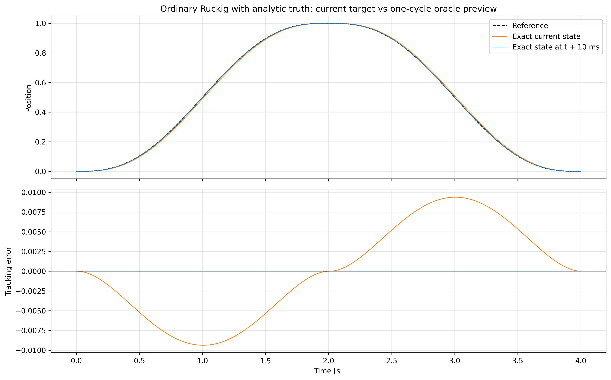
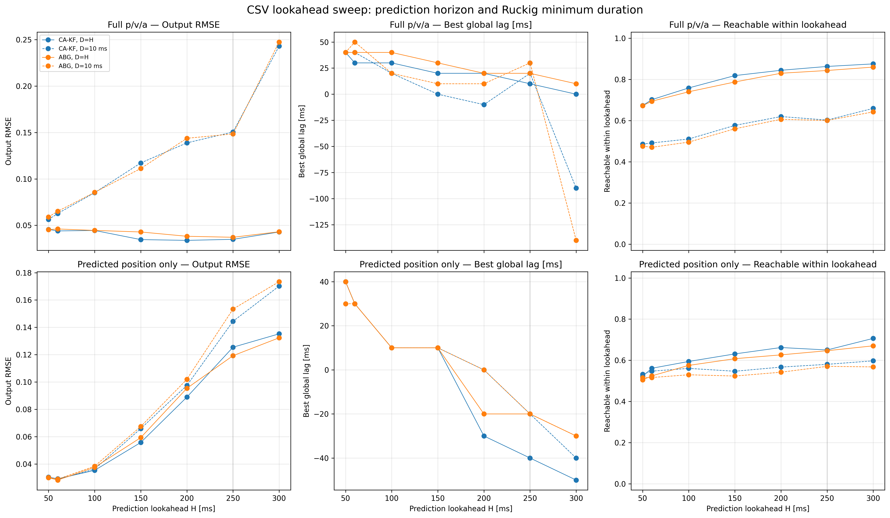
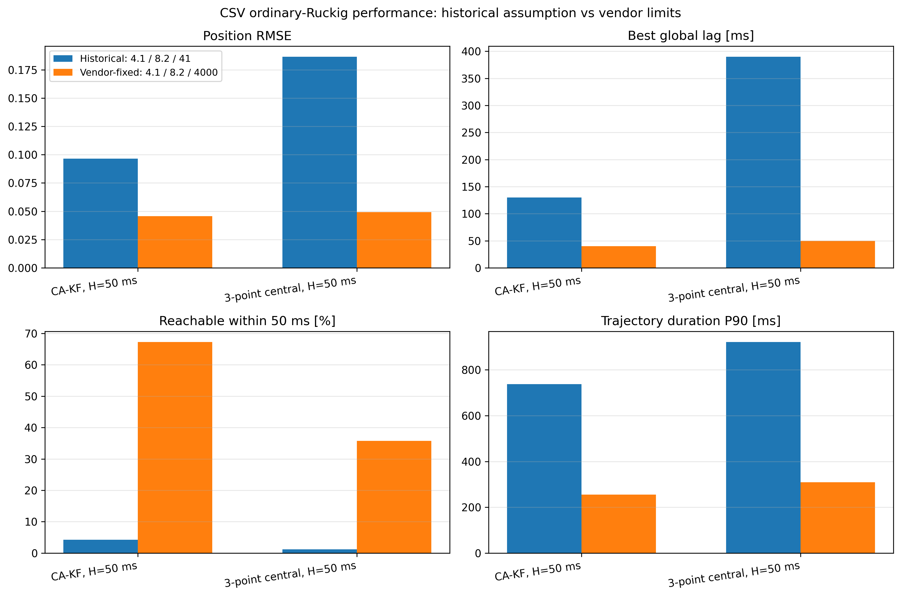

# Ruckig Tracking 在当前场景中的必要性与工程风险评估

> 评估日期：2026-07-13
> 场景：单关节、100 Hz、上游仅提供连续位置样本，输出必须满足 velocity、acceleration 和 jerk 约束。
> 厂商固定限制：$v_{max}=4.1$、$a_{max}=8.2$、$j_{max}=4000$。
> 名称说明：产品名称是 **Ruckig Tracking Interface**，实际 API 类名拼作 `Trackig`。
>
> 当前量化主证据已更新为[固定 10 ms 的受控 P/PV/PVA 实验](ruckig_realtime_tracking_optimization.md)。本文中的旧 estimator/lookahead 数值保留为工程风险背景，不再作为严格消融排名。

## 结论

> 当前场景在工程上需要 tracking-aware 的约束跟随能力。Ruckig Pro `Trackig` 不是数学意义上的唯一实现，但在项目已经集成普通 Ruckig、厂商限制固定为 `4.1/8.2/4000` 的前提下，它是新增代码最少、接口匹配度最高、近期集成与实时验证风险最低的优先候选。即使最终采用 reference governor 或短时域 jerk-QP/MPC，`Trackig` 也应作为独立、可信的性能 baseline。

这项结论包含四层意思：

1. **厂商限制是硬约束，不是调参项。** 后续正式实验必须固定使用 `4.1/8.2/4000`；此前的 `4.1/16/3200`、`4.1/8.2/41` 和更大限制只能视为历史敏感性实验。
2. **普通 `Ruckig.update()` 与移动参考的任务语义不完全匹配。** 它求解当前状态到固定终态的轨迹；当前系统却每 10 ms 替换一次仍在移动的目标。
3. **Pro `Trackig` 不是唯一算法，但替代方案不是同风险等价物。** 自研 governor 或 QP/MPC 需要项目自行承担递归可行性、权重、最坏求解时间、失败降级和长期维护验证。
4. **尚未直接实测 Pro。** 当前环境是 Ruckig Community `0.17.3`，不包含 `Trackig` 和 `TargetState`；因此不能声称它已经被本项目证明最优或完成安全验证。

| 命题 | 当前判断 |
| --- | --- |
| 系统是否需要预测式、状态连续的受限跟踪能力 | 需要；厂商限值下 Position only 仍有 70 ms 整体滞后 |
| 是否只有 Ruckig Pro 能实现 | 否；governor、jerk-QP/MPC 也可实现 |
| 是否应优先实现 Ruckig Pro baseline | 是；近期开发、集成和验证风险最低 |
| Pro 是否必须在每个单项指标上第一才有价值 | 否；独立 baseline、低集成成本和可用 fallback 本身就有价值 |
| 是否可用扫描结果放宽 acceleration/jerk | 否；`4.1/8.2/4000` 由厂商固定，OFAT 只解释敏感性 |

## 1. 固定约束与数据可执行性

### 1.1 厂商限制是正式实验的唯一口径

| 约束 | 固定值 | 在实验中的处理 |
| --- | ---: | --- |
| 最大 velocity | 4.1 | 正式基线固定 |
| 最大 acceleration | 8.2 | 正式基线固定；OFAT 仅解释敏感性 |
| 最大 jerk | 4000 | 正式基线固定；OFAT 仅解释敏感性 |

后续问题不再是“把 acceleration 或 jerk 改到多少才能贴合 CSV”，而是：

> 在厂商固定 `4.1/8.2/4000` 内，哪一种 tracking-aware follower 能以最低综合工程风险取得可接受的误差、滞后和实时性？

### 1.2 原始 CSV 不能被默认视为严格可执行轨迹

当前正式实验使用标准三点二阶差分，而不是历史的连续两次 `gradient`。CSV 的 PVA 原始 target 统计为：

| 诊断量 | CSV 峰值 | 厂商限制 |
| --- | ---: | ---: |
| 离线中心 velocity | 2.05 | 4.1 |
| 三点二阶 acceleration | 280.09 | 8.2 |
| target acceleration 的 sampled jerk | 44460.85 | 4000 |

三种 PVA 差分方法都有 32.64% 的原始 target 需要投影。上述 acceleration/jerk 是从 position-only CSV 构造的 target 诊断量，不是机器人真实状态，也不是 Ruckig 最终输出超限；但它们说明直接差分与厂商 acceleration 约束之间存在明显矛盾。Tracking 的目标应是产生最接近参考的可执行轨迹，而不是承诺零误差复现。

当前实验有意不使用 `elapsed time`：只读取 `value`，并令每行严格代表 10 ms。所有结论都以该固定时间轴为条件；若未来研究原始采样抖动，应建立独立数据口径和结果目录，不能与当前正式指标混用。

## 2. 普通 Ruckig 与 Tracking 的任务语义

Ruckig 原论文研究的是受 velocity、acceleration 和 jerk 限制的**状态到状态**问题：从当前完整状态 $x_0=[p_0,v_0,a_0]$ 出发，以时间最优方式到达固定目标状态 $x_f=[p_f,v_f,a_f]$。它没有直接最小化未来一段移动参考的累计跟踪误差。[Ruckig RSS 2021 论文](https://www.roboticsproceedings.org/rss17/p015.html)

当前普通接口每 10 ms 执行：

1. 从最新位置估计目标 $p/v/a$；
2. 把该状态设为固定终态；
3. 执行生成轨迹的第一个 10 ms；
4. 丢弃剩余轨迹，并对新终态重新规划。

对于持续移动的参考，这相当于不断追赶旧目标。若到达当前参考点需要 $T$，到达时真实参考已经继续运动。提高 jerk 可以缩短追赶时间，但不能改变普通接口追逐固定终态的定义。

Ruckig 官方也明确说明：直接把任意信号的当前状态作为普通 Ruckig target 会持续落后；Tracking Interface 通过预测未来目标状态降低这种滞后。[官方 Tracking 教程](https://docs.ruckig.com/tutorial.html#tracking-interface)

`Trackig` 提供的相关能力包括：

- 面向持续移动 `TargetState` 的在线 `update()`；
- 默认恒加速度预测和可替换的 `prediction_model`；
- 控制预测和跟随平滑程度的 `reactiveness`；
- `Fast`、`Optimized`、`look_ahead_cycles` 和 `max_iterations`；
- 已知完整序列时使用 `calculate_trajectory()` 离线跟踪。

官方说明 `reactiveness=0` 时会退化为没有目标预测的普通轨迹生成，因此它很适合做同接口消融实验。[`Trackig` API](https://docs.ruckig.com/classruckig_1_1Trackig.html) · [在线示例](https://docs.ruckig.com/example_14.html) · [离线示例](https://docs.ruckig.com/example_15.html)

## 3. 实验证据

### 3.1 Oracle 隔离：正确时刻的一步可达目标可以消除普通接口滞后

为了排除 CSV 噪声、导数估计和约束激活，补充了一条解析五次多项式轨迹：2 s 从 0 到 1，再用 2 s 返回 0。

| 指标 | 参考峰值 | 厂商限制 |
| --- | ---: | ---: |
| velocity | 0.9375 | 4.1 |
| acceleration | 1.4433 | 8.2 |
| sampled jerk | 7.3879 | 4000 |

向普通 `Ruckig.update()` 直接输入解析真值：

| 终态时刻 | RMSE | 最大误差 | 整体滞后 | 对齐后 RMSE |
| --- | ---: | ---: | ---: | ---: |
| 当前真值 $x_k$ | 0.005969 | 0.009375 | 10 ms | $4.94\times10^{-17}$ |
| 下一周期 oracle 真值 $x_{k+1}$ | $5.38\times10^{-17}$ | 约 $2.22\times10^{-16}$ | 0 ms | 浮点误差量级 |



[指标 CSV](../results/tracking_necessity/vendor_oracle_preview/oracle_preview_metrics.csv) · [实验脚本](../run_tracking_necessity.py) · [运行参数](../results/tracking_necessity/vendor_oracle_preview/run.json)

这说明普通 Ruckig 对动态一致、一步可达的未来终态可以精确执行。问题不是普通求解器必然多周期滞后，而是在线系统通常没有准确的 $x_{k+1}$；Tracking、governor 或 preview-QP 的核心价值就是生成这个未来可执行状态。

### 3.2 厂商限制下的真实 CSV

下面所有方法仍使用普通 `Ruckig.update()`；“lookahead”来自上游估计器，不是 Pro `Trackig`。

| 普通 Ruckig 的输入方式 | RMSE | 最大误差 | 最佳整体滞后 | 目标时域内可达率 | 轨迹时长 P90 |
| --- | ---: | ---: | ---: | ---: | ---: |
| Position only，$v=a=0$ | **0.03516** | **0.18453** | 70 ms | 8.84%（10 ms） | 116 ms |
| CA-KF，50 ms，full $p/v/a$ | 0.04559 | 0.25857 | **40 ms** | **67.29%**（50 ms） | 255 ms |
| ABG，60 ms，full $p/v/a$ | 0.04606 | 0.25369 | **40 ms** | 69.41%（60 ms） | 247 ms |
| 因果中心差分，50 ms，full $p/v/a$ | 0.04914 | 0.26043 | 50 ms | 35.76%（50 ms） | 310 ms |
| SG-10，50 ms，full $p/v/a$ | 0.05019 | 0.27775 | 60 ms | 36.64%（50 ms） | 279 ms |


[完整指标](../results/tracking_necessity/vendor_limits/realtime_metrics.csv) · [运行参数](../results/tracking_necessity/vendor_limits/run.json)

结果表明：

1. Position only 的 RMSE 最低，但整体滞后达到 70 ms；低 RMSE 部分来自输出平滑和相位落后，不能直接解释为低延迟跟踪更好。
2. 直接加入估计的 full $p/v/a$ 可以把滞后降至 40～60 ms，却增加了换向段最大误差，说明普通滚动终态无法稳定利用高波动导数。
3. 所有主要方法都触及 $a=8.2$，而 velocity 峰值只有 1.59～2.33，远低于 4.1。厂商 `j=4000` 消除了旧 `j=41` 的大部分人为瓶颈后，剩余主要约束已经转为 acceleration。
4. 表中的 sampled jerk 是相邻周期 acceleration 的差分，不等于 Ruckig 连续轨迹内部的瞬时 jerk；target acceleration 差分也不是机器人最终命令。三种 jerk 口径不能混用。

### 3.3 手工 lookahead 能形成 Pareto 改善，但没有一个配置全面占优

在厂商限制下扫描 50～300 ms：

| 配置 | 预测位置 RMSE | 输出 RMSE | 最大误差 | 滞后 | 时域内可达率 | P90 轨迹时长 |
| --- | ---: | ---: | ---: | ---: | ---: | ---: |
| Position only baseline | - | 0.03516 | 0.18453 | 70 ms | 8.84% | 116 ms |
| ABG 60 ms，仅预测位置 | 0.01759 | **0.02827** | 0.18939 | 30 ms | 52.45% | 186 ms |
| CA-KF 200 ms，full $p/v/a$ | 0.10522 | 0.03378 | 0.18383 | 20 ms | 84.44% | 250 ms |
| CA-KF 250 ms，full $p/v/a$ | 0.15658 | 0.03489 | **0.15650** | **10 ms** | **86.30%** | 289 ms |



[扫描指标](../results/tracking_necessity/vendor_limits_lookahead/lookahead_sweep_metrics.csv) · [运行参数](../results/tracking_necessity/vendor_limits_lookahead/run.json)

ABG 60 ms 的 RMSE 最好，但仍有 30 ms 滞后；CA-KF 250 ms 把滞后降至 10 ms、最大误差降至 0.15650，却依赖误差已经很大的远期恒加速度预测。H=300 ms 虽可得到 0 ms 全局滞后，RMSE 又反弹到 0.04281。

因此手工 lookahead 已经证明预测式机制有价值，但它产生的是多个折中点，而不是稳健的单一答案。这正是把 Pro `Trackig` 作为现成 baseline 的意义：在相同限制和 estimator 下，测试其内部预测/跟随机制能否形成更好的 Pareto 前沿，并减少自研状态管理。

### 3.4 旧 `j=41` 是历史假设，不是当前厂商限制

保持 $v=4.1$、$a=8.2$ 不变，将历史实验的 $j=41$ 改为厂商固定的 $j=4000$：

| 方法 | jerk | RMSE | 滞后 | 50 ms 内可达率 | P90 轨迹时长 |
| --- | ---: | ---: | ---: | ---: | ---: |
| CA-KF，50 ms | 41 | 0.09655 | 130 ms | 4.24% | 738 ms |
| CA-KF，50 ms | **4000** | **0.04559** | **40 ms** | **67.29%** | **255 ms** |
| 因果中心差分，50 ms | 41 | 0.18662 | 390 ms | 1.19% | 922 ms |
| 因果中心差分，50 ms | **4000** | **0.04914** | **50 ms** | **35.76%** | **310 ms** |



[对照指标](../results/tracking_necessity/vendor_oracle_preview/constraint_comparison_metrics.csv)

所以旧实验确实受到了过小 jerk 的强烈影响，不能用旧的数百毫秒滞后直接评价厂商限制下的系统。与此同时，改为 4000 后仍存在 40～70 ms 滞后、acceleration 饱和和换向过冲，tracking-aware follower 仍有明确优化空间。

## 4. 为什么 Ruckig Pro 是低风险 baseline

Reference governor 和 jerk-QP/MPC 都是可信的技术路线，但“理论上可行”不等于“与 Pro 具有相同落地风险”。下表针对当前已经集成普通 Ruckig、100 Hz、单关节原型这一具体项目，而不是三类算法的通用排名。

| 工程风险维度 | Ruckig Pro `Trackig` | Stateful reference governor | 短时域 jerk-QP/MPC |
| --- | --- | --- | --- |
| 与移动参考的匹配 | **低**：接口就是为移动 $p/v/a$ 设计 | 中：需选择并实现具体 governor | 低至中：可直接定义 tracking cost，但行为取决于模型和权重 |
| 对现有代码的改动 | **最低**：复用 Ruckig 状态、限制和周期循环 | 中：增加独立状态机和约束逻辑 | 最高：增加预测模型、代价、约束、求解器和状态管理 |
| 参数整定 | 中低：estimator、预测模型、`reactiveness`、模式 | 中：跟踪/平滑和边界切换 | 高：多项权重、horizon、slack、终端项 |
| 可行性与约束验证 | 中：库负责轨迹生成，项目仍做黑盒边界测试 | 中高：异常初态、递归可行和恢复由项目保证 | 高：递归可行、终端制动、slack 和 infeasible fallback 均需设计 |
| 100 Hz 实时风险 | 低至中：有实时接口和迭代上限，但必须在目标硬件测 WCET | 算法完成后可以很低，但开发验证工作较多 | 中高：还需验证热启动、迭代上限、超时和数值条件 |
| 故障与降级处理 | 中：覆盖错误返回、异常预测和版本差异 | 中高：全部自研 | 高：还包括求解失败、非最优退出和上一解失效 |
| 可解释与可审计 | 中高风险：公开 API，但内部实现不可公开审计 | **低风险**：算法和实现完全可控 | 中：模型透明，求解器数值行为仍需验证 |
| 许可与供应商依赖 | **高风险**：需确认 Pro 授权、部署和长期支持 | 低 | 低至中，取决于求解器许可 |
| 近期综合交付风险 | **最低，适合作为第一 baseline** | 第二选择，适合作为自主 fallback | 最高，适合作为 baseline 不足后的性能增强 |

这里的“风险更小”特指**近期开发、集成、实时验证和回归工作量**。它不表示 Pro 在许可成本、闭源可审计性和长期供应链方面风险最低，也不表示它已经获得本项目或机器人厂商的安全认证。

Gerelli 与 Guarino Lo Bianco 的离散时间滤波器证明了代数型 stateful governor 可以在参考不可达时保持 velocity、acceleration 和 jerk 可行，是可信的开源/自研 fallback；但生产实现、多关节扩展、异常状态和回归仍需项目承担。[ICRA 2010 原文](https://fileadmin.cs.lth.se/ai/Proceedings/ICRA2010/MainConference/data/papers/0271.pdf)

单关节五步 jerk-QP 的规模很小，OSQP 等求解器也支持因子分解缓存、热启动和不可行检测；但这些能力不会自动解决代价设计、递归可行性、超时降级和 WCET 证明。[OSQP 论文](https://web.stanford.edu/~boyd/papers/osqp.html)

### 4.1 即使不是最终方案，Pro baseline 仍然有价值

1. 提供一个不依赖本项目自研权重和切换逻辑的独立参考结果；
2. 帮助区分误差来自 estimator、参考不可达，还是自研 follower 实现；
3. 给 governor/QP 设定必须超过的精度、延迟和实时性基准；
4. 当自研算法异常或延期时，可以作为 fallback；
5. 把讨论从“自研算法能不能工作”变成“它相对成熟 baseline 增加了多少可量化价值”。

因此，Pro baseline 不需要先证明在每一个指标上绝对第一才值得集成。生产选型应综合精度、最坏延迟、约束行为、异常处理、验证成本、许可和维护风险。

### 4.2 Pro 需要单独管理的风险

正式采用前应确认：

- 开发机、CI、测试台和每台机器人如何授权；
- 产品交付和再分发是否允许；
- 是否支持离线部署、固定版本和长期使用；
- 目标平台、编译器、ABI 与升级兼容策略；
- 缺陷修复、技术支持和供应商停止维护时的替代安排；
- 是否能获得源码访问、审计材料或 escrow。

建议把 `Trackig` 封装在项目自己的 follower 接口后面，避免上层业务代码直接依赖专有类型，并保留普通 Ruckig 或 reference governor 作为降级路径。

## 5. Ruckig Tracking 不能自动解决的问题

1. **它仍需要可靠的目标状态。** 官方 `TargetState` 包含 position、velocity、acceleration；位置流仍需因果 estimator。
2. **它不能突破 `4.1/8.2/4000`。** 参考不可达时只能在可行性与跟踪误差之间折中。
3. **默认恒加速度预测不适合所有换向。** 当前 lookahead 扫描已显示远期预测误差快速增加。
4. **它不能替项目决定采样语义。** 当前项目已固定为每行 10 ms；若未来改为原始时间戳口径，必须独立验证 estimator 和 follower。
5. **当前没有直接 Pro 数据。** Community `0.17.3` 不包含该接口，正式 A/B 应记录 Pro 版本，并尽量让普通 Ruckig 与 `Trackig` 使用一致的核心版本。
6. **单轴运动学不等于整机安全。** 多关节同步、力矩、负载、碰撞和控制器内部 limiter 仍需实机验证。

## 6. 推荐的阶段性验证

### 阶段 0：固定输入口径

- 固定厂商限制 `4.1/8.2/4000`，禁止用放宽限值改善结果；
- CSV 只读取 `value`，忽略 `elapsed time`，每行固定按 10 ms；
- 明确关节单位、关节编号、负载和实际控制模式；
- 固定同一 CSV、初态、estimator 和误差计算区间。

### 阶段 1：先建立 Pro baseline

在同一输入和限制下比较：

1. Position only 普通 `Ruckig.update()`；
2. 当前手工 lookahead Pareto baseline；
3. `Trackig`，`reactiveness=0`；
4. `TrackigMode::Fast`，扫描少量 `reactiveness`；
5. `TrackigMode::Optimized`，扫描少量 `reactiveness`；
6. 统一 estimator 下的自定义 `prediction_model`；
7. 完整 CSV 的 `calculate_trajectory()` 离线上界。

不要在 estimator 和 `Trackig` 中重复做两次 lookahead。输入 `Trackig` 的应是同一时刻目标状态，由 `Trackig` 或统一的自定义模型负责未来预测。

### 阶段 2：再决定是否开发替代方案

- 若 Pro 达到误差、滞后、约束和目标硬件 WCET 要求，且许可可接受，优先作为生产候选；
- 若 Pro 在换向、急停或已知 preview 场景不足，再开发 jerk-QP/MPC；
- 若许可、闭源或供应链风险不可接受，优先实现 Gerelli 型 stateful governor；
- 自研方案应在相同数据、限制和硬件上相对 Pro baseline 给出明确增益，才能证明额外复杂度合理。

## 7. 指标和决策门槛

厂商限制下当前已有三个代表性普通 Ruckig 基线：

| 基线 | RMSE | 最大误差 | 滞后 | 特点 |
| --- | ---: | ---: | ---: | --- |
| Position only | 0.03516 | 0.18453 | 70 ms | 最简单、稳定，但明显滞后 |
| ABG 60 ms，仅预测位置 | **0.02827** | 0.18939 | 30 ms | 当前 RMSE 最优 |
| CA-KF 250 ms，full $p/v/a$ | 0.03489 | **0.15650** | **10 ms** | 当前低滞后、低最大误差折中 |

Pro baseline 统一记录：

- position RMSE、MAE、最大误差；
- 最佳整体滞后与时间对齐后 RMSE；
- 平滑、急停、换向段的局部最大误差；
- velocity、acceleration、连续轨迹 jerk 峰值和超限率；
- 单周期计算时间 P99、最大值和迭代次数；
- 错误返回、异常输入、超时和降级行为。

生产候选至少必须：

- 严格遵守厂商 `4.1/8.2/4000`；
- 在目标 C++ 控制线程上最坏计算时间低于 10 ms，并保留系统余量；
- 在换向和急停段没有不可接受的新过冲；
- 位于当前 Pareto 基线之上，或在性能近似非劣时显著降低集成、验证和维护风险。

对于 governor 或 QP/MPC，仅仅“也能运行”不够。它应相对 Pro baseline 明确满足至少一项重要增益，例如显著降低 RMSE/最大误差、满足 Pro 无法达到的延迟要求、利用已知 preview，或消除不可接受的许可/供应链风险。

## 8. 最终建议

1. **将 `4.1/8.2/4000` 固定为唯一正式实验限制。** 不再用 limit scan 选择可部署参数。
2. **尽快获取 Ruckig Pro 评估版本并建立 baseline。** 这是当前新增代码和近期工程风险最低的路径。
3. **通过项目自有 follower 接口隔离 Pro 依赖。** 同时保留 governor fallback，控制长期供应链风险。
4. **只有当 Pro baseline 暴露明确性能缺口时，再投入 jerk-QP/MPC。** 让更复杂方案用数据证明其增量价值。
5. **在线与离线场景分开。** 未来未知时用 estimator + online follower；完整 CSV 已知时使用 offline Tracking 或 preview/path-retiming 方法。

综合而言，Ruckig Pro `Trackig` 的必要性不在于“只有它能解”，而在于它是当前最合适的**低风险 reference implementation 和 baseline**。先建立这个基线，再决定是否承担自研 governor 或 QP/MPC 的额外复杂度，是风险更可控的技术路线。

## 参考资料

- Berscheid, L. & Kröger, T., [Jerk-limited Real-time Trajectory Generation with Arbitrary Target States](https://www.roboticsproceedings.org/rss17/p015.html), RSS 2021.
- Ruckig, [Tracking Interface 教程](https://docs.ruckig.com/tutorial.html#tracking-interface).
- Ruckig, [`Trackig` API](https://docs.ruckig.com/classruckig_1_1Trackig.html).
- Ruckig, [在线 Tracking 示例](https://docs.ruckig.com/example_14.html) 与 [离线 Tracking 示例](https://docs.ruckig.com/example_15.html).
- Gerelli, O. & Guarino Lo Bianco, C., [A Discrete-Time Filter for the On-Line Generation of Trajectories with Bounded Velocity, Acceleration, and Jerk](https://fileadmin.cs.lth.se/ai/Proceedings/ICRA2010/MainConference/data/papers/0271.pdf), ICRA 2010.
- Stellato, B. et al., [OSQP: An Operator Splitting Solver for Quadratic Programs](https://web.stanford.edu/~boyd/papers/osqp.html), Mathematical Programming Computation, 2020.
- Lange, F. & Albu-Schäffer, A., [Path-Accurate Online Trajectory Generation for Jerk-Limited Industrial Robots](https://elib.dlr.de/101288/), IEEE RA-L 2016.

## 复现命令

```bash
# 厂商限制下的 oracle 隔离与历史 jerk 对照
.venv/bin/python run_tracking_necessity.py \
  --output-dir results/tracking_necessity/vendor_oracle_preview

# 厂商固定限制下的 estimator 对比
.venv/bin/python - <<'PY'
import sys
import run_experiments as experiment

experiment.LIMITS.update(
    max_velocity=4.1,
    max_acceleration=8.2,
    max_jerk=4000.0,
)
sys.argv = [
    "run_experiments.py",
    "--output-dir",
    "results/tracking_necessity/vendor_limits",
]
experiment.main()
PY

# 厂商固定限制下的 lookahead 扫描
.venv/bin/python - <<'PY'
import sys
import run_experiments
import run_lookahead_sweep as sweep

limits = dict(max_velocity=4.1, max_acceleration=8.2, max_jerk=4000.0)
run_experiments.LIMITS.update(**limits)
sweep.LIMITS.update(**limits)
sys.argv = [
    "run_lookahead_sweep.py",
    "--output-dir",
    "results/tracking_necessity/vendor_limits_lookahead",
]
sweep.main()
PY
```
